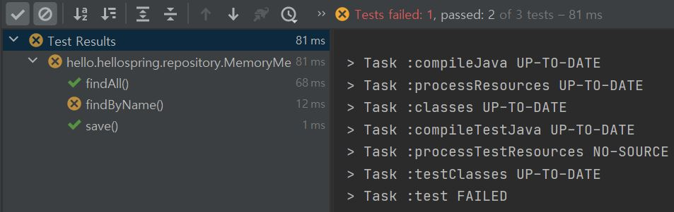
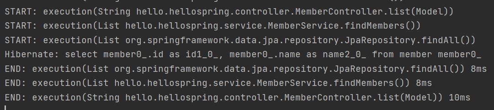

# Spring

https://www.inflearn.com/ 에서 '스프링 입문 - 코드로 배우는 스프링 부트, 웹 MVC, DB 접근 기술_김영한' 강의를 보고 정리했다.

---
---
## 목차
ㄴ
- [Spring](#spring)
  - [목차](#목차)
  - [강의소개](#강의소개)
    - [간단한 웹 애플리케이션 개발](#간단한-웹-애플리케이션-개발)
    - [프로젝트 사용기술](#프로젝트-사용기술)
    - [강의 목표](#강의-목표)
    - [스프링 완전 정복 로드맵](#스프링-완전-정복-로드맵)
  - [프로젝트 환경설정](#프로젝트-환경설정)
    - [스프링 부트 스타터 사이트로 이동해서 스프링 프로젝트 생성](#스프링-부트-스타터-사이트로-이동해서-스프링-프로젝트-생성)
    - [설치 후 인텔리제이에서 구조 살펴보기](#설치-후-인텔리제이에서-구조-살펴보기)
    - [한번 돌려보기](#한번-돌려보기)
  - [- 여기까지 진행했으면 프로젝트 환경 설정에 성공.](#--여기까지-진행했으면-프로젝트-환경-설정에-성공)
    - [라이브러리 살펴보기](#라이브러리-살펴보기)
    - [View 환경설정](#view-환경설정)
    - [Controler](#controler)
    - [빌드하고 실행하기](#빌드하고-실행하기)
  - [## 스프링 웹 개발 기초](#-스프링-웹-개발-기초)
    - [웹을 개발한다는 것](#웹을-개발한다는-것)
    - [정적 컨텐츠](#정적-컨텐츠)
    - [MVC와 템플릿 엔진](#mvc와-템플릿-엔진)
  - [API 방식](#api-방식)
  - [## 회원 관리 예제 - 백엔드 개발](#-회원-관리-예제---백엔드-개발)
    - [비즈니스 요구사항 정리](#비즈니스-요구사항-정리)
    - [회원 도메인과 리포지토리 만들기](#회원-도메인과-리포지토리-만들기)
    - [회원 리포지토리와 테스트 케이스 작성](#회원-리포지토리와-테스트-케이스-작성)
    - [회원 서비스 개발](#회원-서비스-개발)
    - [회원 서비스 테스트](#회원-서비스-테스트)
  - [스프링 빈과 의존관계](#스프링-빈과-의존관계)
    - [컴포넌트 스캔과 자동 의존관계 설정](#컴포넌트-스캔과-자동-의존관계-설정)
    - [정리](#정리)
  - [회원 관리 예제 - 웹 MVC 개발](#회원-관리-예제---웹-mvc-개발)
    - [회원 웹 기능 - 홈 화면 추가](#회원-웹-기능---홈-화면-추가)
    - [회원 웹 기능 - 등록](#회원-웹-기능---등록)
    - [회원 웹 기능 - 조회](#회원-웹-기능---조회)
  - [스프링 DB 접근 기술](#스프링-db-접근-기술)
    - [H2 데이터베이스 설치](#h2-데이터베이스-설치)
    - [순수 Jdbc](#순수-jdbc)
    - [스프링 통합 테스트](#스프링-통합-테스트)
    - [스프링 JdbcTemplate](#스프링-jdbctemplate)
    - [JPA](#jpa)
    - [스프링 데이터 JPA](#스프링-데이터-jpa)
  - [AOP](#aop)
    - [AOP가 필요한 상황](#aop가-필요한-상황)
    - [AOP 적용](#aop-적용)
  - [다음으로](#다음으로)
    - [이때까지 한 내용](#이때까지-한-내용)
    - [다음으로](#다음으로-1)


---
---
## 강의소개

---
---

### 간단한 웹 애플리케이션 개발

- 스프링 프로젝트 생성
- 스프링 부트로 웹 서버 실행
- 회원 도메인 개발
- 웹 MVC 개발
- DB 연동 - JDBC, JPA, 스프링 데이터 JPA
- 테스트 케이스 작성

---

### 프로젝트 사용기술

- Spring Boot
- Gradle
- Thymeleaf
- HIBERNATE
- JPA

---

### 강의 목표

- 스프링 학습의 제대로 된 첫 길잡이 역할
- 스프링 기술 그 자체에 매몰 X
- 어떻게 사용해야 하는지에 초점
- 오래된 스프링 기술 X
- 마이너한 스프링 기술 X

---

### 스프링 완전 정복 로드맵

- 스프링 입문
- 스프링 핵심 원리
- 스프링 웹 MVC
- 스프링 DB 데이터 접근 기술
- 실전! 스프링 부트


---
---

## 프로젝트 환경설정

---
---

### 스프링 부트 스타터 사이트로 이동해서 스프링 프로젝트 생성

- 옛날에는 스프링 프로젝트를 밑바닥부터 만들었지만, 요즘은 스프링 부트를 기반으로 스프링 프로젝트를 만듦.
- https://start.spring.io
  

- Project
  - 필요한 라이브러리를 땡겨서 오고, 얘가 빌드하는 라이프사이클까지 관리해주는 툴
  - 옛날에는 Maven, 요즘은 Gradle로 넘어가는 추세
  - 

- Language
  - Java
- Spring Boot
  - 버젼을 선택을 해야함
  - SNAPSHOT
    - 만들고 있는 버전
  - M1 ...
    - 정식 배포된 버전이 아님
  - 정식 배포된 버전 중 가장 좋아보이는 2.4.2로 선택
    
- Project Metadat
  - Group
    - 보통 기업명을 적음
  - Artifact
    - 빌드되어 나올때 나오는 결과물(프로젝트 명과 비슷)
  - 그외는 그냥 유지
  
- Dependencies
  - 이게 중요함.
  - Spring boot 기반으로 프로젝트를 시작할건데 어떤 라이브러리를 땡겨서 사용할 것인가에 대한 내용
  - 여기서는 web project를 만들거니까 'spring web'과 'thymeleaf'를 추가
    <br/>
    
    - thymeleaf
      - html을 만들어주는 템플릿 엔진.


- 그 후, Generate를 누르면 다운로드를 받게 된다.<br/>
    
    - 그후 원하는 폴더로 옮긴 후 압출을 풀고 '인텔리제이'에서 열기
    - 압축 푼 경로로 가서 build.gradle을 눌러서 Open
    - 

---

### 설치 후 인텔리제이에서 구조 살펴보기

- gradle 폴더
  - gradle 관련 폴더임
- src 폴더
  - main
    - java
      - 실제 package랑 소스 파일이 있음.
    - resources
      - 실제 자바 코드 파일을 제외한 xml 이나 properties나 설정파일, html 등이 들어가있음.
  - test
    - test code들과 관련된 소스들이 들어감.
    - 요즘 개발 트랜드에서 test code는 중요함
  - build.gradle
    - 이게 중요함.
    - 나중에 깊게 공부하고 지금은 gradle이 버전 설정을 하고 라이브러리를 땡겨온다 정도만 이해.
    - 
      - sourceCompatibility = '11' 은 Java 11 버전을 의미.
    - dependencies
      - 
      - implementation
        - 아까 추가한 것들
      - testImplementation
        - 기본적으로 test 라이브러리가 자동으로 들어감.
      - 
        - 이유는 모르겠으나 testImplementation 밑에 exclude가 자동으로 안적혀있어서 그냥 내가 적음.
    - repositories
      - 위 dependencies의 라이브러리를 다운받아야하는데 mavenCentral()이라는 공개된 사이트에서 다운로드 받아라라고 설정을 함.
  - .gitignore
    - 소스코드 관리해주는 곳
    - git에는 필요한 소스코드 파일만 올라가고 build된 결과물은 올라가면 안되니까 설정하는 곳은데 start.io에서 다 설정을 해줬음
  - settings.gradle
    - 나중에 gradle 배울때 공부하기
  
---

### 한번 돌려보기

- 
  - 이 경로로 들어간 뒤
- 
  - 이러한 코드들이 나온다.
- 
- 실행 후 이러한 화면이 글들이 나온다.(중요)
  - 
    - 밑에서 두번째 줄 tomcat에서 http로 port 8080으로 뜸.
- 그 후, localhost:8080 접속하면 아래와 같이 뜸.
  - 

- 여기까지 진행했으면 프로젝트 환경 설정에 성공.
---

### 라이브러리 살펴보기

편안하게 살펴봄

- 
  - 뭔가가 굉장히 많다.
  - gradle이나 maven 같은 build 툴들은 의존관계를 다 관리를 해줌
    - ex>우리가 start.sprnig.io에서 추가한 spring-booter-starter-web을 땡기면 이것이 필요한 라이브러리인 톰캣, spring web, spring MVC 이런것들을 땡겨옴(== 의존관계를 가짐)
      - 우리는 spring-booter-starter-web만 필요하지만 이 spring-booter-starter-web이 필요한 것들에도 의존을 하고 있다.
      - 그러면 gradle은 꼬리를 물어 그 친구들을 전부 땡겨온다.

- '인텔리제이' 오른쪽에 보면 gradle이 있는데 이걸 클릭하면 아래와 같이 나온다.
  - 
  - Dependencies
    - 라이브러리들과의 의존관계
    - 
      - 나는 thymeleaf 와 web 이 2개만 땡겨왔었다.
    - 
      - 하지만 위 사진 처럼 여러개의 필요한 라이브러리를 꼬리에 꼬리를 물어 계속 땡겨옴
    - tomcat
      - web server를 띄웠던 것
      - 옛날에는 WAS(or Web Server)를 직접 서버에 설치(tomcat 같은것), 그리고 거기에 자바 코드를 집어넣는다.
        - 웹서버랑 개발 라이브러리가 분리가 되어 있었다.
        - 되게 힘든 작업이지만 요즘에는 소스 라이브러리에서 웹서버를 들고있다(==임베디드(혹은 내장하고 있다.)) → 실행만 하는데도 웹서버가 뜸.
        - 
- log 관련
  - 현업에서는 System.out.println으로 출력하면 안됨 → log라는 걸로 출력해야함.
    - 그래야 log로 남겨야 심각한 것들을 따로 보는 등 log 파일을 따로 관리해서 볼 수 있음.
  - 
    - slf4j == 인터페이스
    - 실제 log를 어떤 구현체로 출력할 것인가는 요즘 logback을 많이 선택함.
    - log 관련해서 궁금한게 있으면 위 2개를 검색해서 알아보기

- test 관련 라이브러리
  - junit
    - java에서 test할때 junit 라이브러리를 보통 사용한다.

- 결론(핵심 라이브러리 → 강의자료에 나옴)
  - 스프링 부트 라이브러리
    - spring-boot-starter-web
      - spring-boot-starter-tomcat: 톰캣 (웹서버)
      - spring-webmvc: 스프링 웹 MVC
    - spring-boot-starter-thymeleaf: 타임리프 템플릿 엔진(View)
    - spring-boot-starter(공통): 스프링 부트 + 스프링 코어 + 로깅
      - spring-boot
        - spring-core
      - spring-boot-starter-logging
        - logback, slf4j
  - 테스트 라이브러리
    - spring-boot-starter-test
        - junit: 테스트 프레임워크
        - mockito: 목 라이브러리
        - assertj: 테스트 코드를 좀 더 편하게 작성하게 도와주는 라이브러리
        - spring-test: 스프링 통합 테스트 지원
---

### View 환경설정

- Welcome Page 만들기
  - 
  - localhost:8080에 접속하면 아래와 같이 뜸.
    
  - hello 를 누르면 아무것도 없으므로 에러가 뜸.
    
- Spring 기능이 엄청 많아 spring.io 에서 필요한 걸 찾는 능력이 중요함.
  - ex> Welcome Page 관련
    - spring.io → Project → Spring Boot → LEARN → 2.4.2 옆의 Reference Document 클릭 → Spring Boot Features → ctrl+F 로 welcome page 검색
      
    - 근데 이거는 정적(static)임.
- 템플릿 엔진
  - 템플릿 엔진을 사용하면 정적이아닌 동적으로 페이지를 바꿀 수 있음.
  - 여기서는 thymeleaf 템플릿 엔진 사용.
  - thymeleaf 공식 사이트: https://www.thymeleaf.org/
  - 스프링 공식 튜토리얼: https://spring.io/guides/gs/serving-web-content/
  - 스프링부트 메뉴얼: https://docs.spring.io/spring-boot/docs/2.3.1.RELEASE/reference/html/spring-boot-features.html#boot-features-spring-mvc-template-engines


---

### Controler

- 
  - hello.hellospring 안에 'controller' 라는 Package 생성
    - 'controller' Package안에 'HelloController' 라는 Java Class 생성
- Controller Class는 @Controller를 위에 적어줘야함.(아래 사진에서 제일 위 'Controller'라고 적힌거)
  - @를 Annotatino이라고 함.
  - 

- 
  - @GetMapping(~~)
  - 웹 어플리케이션에서 /hello 라고 들어오면 아래의 method를 호출해준다.
- 아래와 같이 코드 작성
    ```java
    package hello.hellospring.controller;

    import org.springframework.stereotype.Controller;
    import org.springframework.ui.Model;
    import org.springframework.web.bind.annotation.GetMapping;

    @Controller
    public class HelloController {
        @GetMapping("hello")
        public String hello(Model model){
            model.addAttribute("data", "hello!!");
            return "hello";
        }
    }

    ```
- 그 후, src/resources/templetes/ 에 hello.html 생성
  - 
  - 강의 자료에 있는 코드 복붙
    - 
  
- 
  - xml 스키마로 템플릿 엔진이 선언이 되어있는 모습.
  - 이러면 템플릿 엔진인 thymeleaf 문법을 사용할 수 있다.
- 
  - "${data}" 는 아까 Controller에 작성한 model.addAttribute에서 key넣었던 "data"의 value는 "hello!!"이다.
    - 즉, "${data}" → "hello!!"로 치환.
  - 
- 
  - @GetMapping에서의 Get은 Get / Post 할때 그 Get임
    - http url 을 임의로 치고 엔터치면 그걸 Get 방식이라고 함.
    - 그러면 controller에 있는 해당 method가 실행이 됨.
    - Spring이 Model이라는 것을 만들어서 매개변수로 넣어줌.
    - model에다가 addAttribute해서 key는 "data", value는 "hello!"를 넣어준다.
    - 그리고 "hello"를 리턴해준다.
      - 
        - return "hello"의 의미는 resources/templetes/hello로 가서 model이라는 것을 넘겨라.
    - mapping 경로는 resources:templates/'+{ViewName}+'.html'이다.
- 참고: spring-boot-devtools 라이브러리를 추가하면, html 파일을 컴파일만 해주면 서버 재시작 없이 View 파일 변경이 가능하다.
- 인텔리J 컴파일 방법: 메뉴 build Recompile

---

### 빌드하고 실행하기

- 강의에서는 맥 터미널로 진행해서 나는 wsl2로 진행함. → windown와 wsl2에서 java 환경변수 문제로 안되어서 그냥 cmd창에서 진행함(<strong>git bash</strong>로 하는게 더 편한듯)
  - gradlew + enter → gradlew build + enter
  - 그 후 build/libs 로 들어가기
    - 
  - 그 후, java -jar hello-spring-0.0.1-SNAPSHOT.jar 을 입력하면 console에서 저 jar 파일이 실행이 됨.
- 즉, 서버를 배포할때는 저 jar 파일만 복사해서 서버에 넣고 거기에서 java -jar를 실행시키면 서버에서 spring이 동작을 함.

- ./gradlew clean build
  - build 폴더가 없어짐
- 

---
---
## 스프링 웹 개발 기초
---
---

### 웹을 개발한다는 것
  1. 정적 컨텐츠
     - 서버에서 뭐 하는거 없이 그냥 파일을 그대로 웹브라우저로 내려줌  
  2. MVC와 템플릿 엔진
     - 가장 많이 하는 방식
     - jsp, php → 이것들은 템플릿 엔진
     - Model-View-Controller 패턴으로 개발함 
     - server에서 변형해서 <strong>html</strong>을 바꿔서 내려주는 방식
  3. API 방식
     - 안드로이드나 아이폰 client랑 개발하면 서버에서는 <strong>json</strong>이라는 data format으로 내려줌 
     - api로 data만 내려주면 화면은 client가 알아서 그리고 정리하는데 이때 api방식을 많이 사용
     - 서버끼리 통신할때 html을 주고받을 필요 없이 data만 주고 받기 위해 사용함

---

### 정적 컨텐츠
  - spring boot는 정적 컨텐츠 기능을 기본적으로 제공
  - resources/static/ 에서 hello-static.html 생성해서 강의자료에 있는 코드 복붙
  - 
  - 
    - 웹 브라우저에서 localhost:8080/hello-static.html 치면<br/> 
      1) 내장 톰켓 서버가 요청을 받고
      2) hello-static.html이 왔다는 것을 spring에게 넘김 
      3) spring은 controller쪽에서 hello-static이라는 것이 있는지 찾아본다(controller가 우선순위를 가진다는 뜻) 
      4) hello라는 controller는 있었지만 hello-static이라는 controller는 없음 
      5) 없으면 그 다음 resources:static/hello-static.html 이라는 것을 찾는다. 
      6) 그렇게 해서 있으면 그것을 반환해줌

---

### MVC와 템플릿 엔진

  - MVC == Model-View-Controller
  - 과거에는 controller랑 view가 따로 분리되어 있지 않고 view에서 개발을 다함
    - jsp나 asp 그렇게 많이 함
    - 이를, Model one 방식이라고 함
    - 이렇게하면 유지보수 너무 힘들다. view 파일에만 수천 줄의 코드가 된다.
  - 요즘에는 MVC 방식으로 많이 함.
    - 관심사를 분리해야하기 때문에(역할과 책임)
    - View는 화면을 그리는데에 집중
    - Model 이나 Controller는 뭔가 business logic이나 내부적인 것(백엔드)을 처리하는데 집중.
    - 그래서 백엔드에서 처리를 하여서 화면(View)에서 필요한 정보들을 model이라는 것에 담아서 넘겨주는 패턴을 많이 사용.
- 
  - 저기서 hello! empty는 템플릿 엔진으로서 동작을 하면 왼쪽의 값으로 내용이 치환, 템플릿 엔진으로서 동작을 안하면(서버없이 파일의 경로로 직접 열 경우) hello! empty 출력

- controller에다가 추가로
    ```java
    @GetMapping("hello-mvc")
        public String helloMvc(@RequestParam("name") String name, Model model){
            model.addAttribute("name",name);
            return "hello-template";
        }
    ```
    를 입력하고, localhost:8080/hello-mvc를 치면 에러가 남.
    - 에러가 나면 일단 log를 봐야함.
      - 
      - 
    - @RequestParam("name")으로 커서 이동 후 Ctrl+P 누르면 파라미터 정보를 볼 수 있음
  - localhost:8080/hello-mvc?name=spring을 입력하면 http GET 방식에서 ? ~~~ 로 parameter를 넘겨줄 수 있음.
    - 그러면 name에 spring을 넘겨주어서 다음과 같은 결과가 나온다.
    - 
  - 
    - 웹브라우저에서 localhost:8080/hello-mvc를 넘기면
      1) 내장 톰켓 서버를 거쳐서 spring한테 hello-mvc라는 것이 왔다고 던져줌
      2) spring은 helloController에 저 method가 mapping이 되어 있어서 그 method를 호출해준다
      3) return은 "hello-template" model(name:spring) 이렇게 spring한테 넘겨준다
      4) viewResolver(화면과 관련된 해결자, view를 찾아주고 템플릿 엔진과 연결 시켜줌)가 templates/hello-template.html를 찾아서 thymeleaf 템플리 엔진에 처리해달라고 넘김.
      5) 템플릿 엔진이 렌더링을 해서 변환을 한 html을 웹 브라우저에 반환을 한다.(정적일때는 이때, 변환을 하지 않고 반환)
  - 

---

## API 방식

- 일단 코딩
  - 마찬가지로 controller에 아래 코드 추가
    ```java
    @GetMapping("hello-string")
    @ResponseBody
    public String helloString(@RequestParam("name") String name){
        return "hello " + name;
    }
    ``` 
    - @ResponseBody란 http 통신 프로토콜에서 header와 body가 있는데 body에 이 data를 내가 직접 넣어주겠다라는 뜻.(html에서의 body 태그가 아님)
    - 템플릿 엔진과의 차이는 View 이런거 없이 문자가 그대로 내려감.
    - 실행하면 아래와 같이 나옴.
        
    - 코드를 보면 이렇게 나옴
        
        - 그냥 문자가 그대로 내려감.(즉, view 없이 그대로 내려줌)
        - 근데 이렇게는 거의 쓸 일 없음
- 뭔가 data를 줘야할 떄(이거 때문에 api 방식을 많이 사용)
  - 일단 코딩
    ```java
    @GetMapping("hello-api")
    @ResponseBody
    public Hello helloApi(@RequestParam("name") String name){
        Hello hello = new Hello();
        hello.setName(name);
        return hello;
    }

    static class Hello{
        private String name;

        public String getName() {
            return name;
        }

        public void setName(String name) {
            this.name = name;
        }
    }
    ``` 
    - return을 class로 넘겨준다.
    - class에는 getter와 setter가 있어야 하는데 이는 alt+insert(나같은 경우 alt+function+delete)를 눌러줘서 getter and setter 클릭
    - 참고로, 인텔리제이에서 자동완성 단축키는 ctrl+shift+enter 이다.
    - getter, setter 란 java bin 규약이라고 함
      - private String name 같은 경우 private이니까 외부에서 못 꺼내니까 외부에서 사용할려면 이러한 getter나 setter를 통해서 접근을 하게 됨.
      - property 접근 방식이라고도 함.
  - 그 후 실행하면, 아래와 같이 나옴
    - 
      - json이란 간단히 설명하면 key:value로 이루어진 구조.
  - spring 같은 경우 객체를 반환하고 @ResponseBody를 적어두면 그러면 json으로 반환하는게 default임.(xml으로도 할 수는 있음. 근데 요즘은 잘 안사용한다.)

- @ResponseBody 사용 원리
  - 
    - 웹 브라우저에서 먼저 localhost:8080/hello-api를 입력하면
      1) 톰켓 내장 서버에서 hello-api가 왔다고 spring에게 던짐.
      2) spring은 controller에 hello-api를 찾고 찾았는데 @ResponseBody라는 annotation이 붙어있으면(안 붙어 있으면(즉, 템플릿 같은경우) viewResolver에거 던져줌) 이때 반환하는 값이 객체가 오면 json 방식으로 데이터를 만들어서 http 응답에 반환하겠다(이게 기본 정책)<br/>
      return: hello(name:spring)
      3) HttpMessageConverter라는 아이가 동작을 함.
         1) 단순 문자이다 → StringConverter가 동작(실제 이름은 StringHttpMessageConverter)
         2) 객체이다 → JsonConverter가 동작(실제 이름은 MappingJackson2HttpMessageConverter)
            - 객체를 json 스타일로 바꾼다.
            - Jackson이란 객체를 json으로 바꿔주는 라이브러리
              - 객체를 json으로 바꿔주는 유명한 라이브러리는 jackson과 gson이 이렇게 있다.
      4) 바꾼 json을 요청한 서버 혹은 웹브라우저에게 준다.

- 정리
  - 정적 컨탠츠
    - 그냥 파일을 그대로 내려준다.
  - MVC 와 템플릿 엔진
    - 템플릿 엔진을 Model-View-Control 방식으로 쪼개서 이제 View를 템플릿 엔진으로 html을 랜더링해서 랜더링이 된 html을 client에게 전달해준다.
  - API
    - 객체를 반환해서 httpmessageconverter를 통해서 json 파일로 변환 후 반환을 해줌
    - view 이런거 없이 바로 http response에 다가 바로 줌.

---
---
## 회원 관리 예제 - 백엔드 개발
---
---

- 비즈니스 요구사항 정리
- 회원 도메인과 리포지토리 만들기
- 회원 리포지토리 테스트 케이스 작성
- 회원 서비스 개발
- 회원 서비스 테스트 ( → junit이라는 test 프레임워크로 만들거임)

---

### 비즈니스 요구사항 정리

간단하게 하겠음.
- 데이터: 회원 ID, 이름
- 기능: 회원 등록, 조회
- 가상의 시나리오: 아직 데이터 저장소가 선정되지 않았다.
  - ex> 개발자가 개발을 해야하는데 DB가 선정이 안되었을 경우(DB를 관계형 DB를 할지, NoSQL을 할지, 성능이 중요한 DB를 할지 등)인데도 개발을 해야하는 경우

- 
  - 컨트롤러
    - 웹 MVC의 컨트롤러의 역할
  - 서비스
    - 핵심 비즈니스 로직 구현
    - EX> 회원은 중복가입이 안된다.
  - 도메인
    - 회원, 주문, 쿠폰 등등 처럼 주로 데이터베이스에 저장하고 관리되는 비즈니스 도메인 객체
  - 서비스
    - 비즈니스 도메인 객체를 가지고 핵심 비즈니스 로직이 동작하도록 구현한 계층

- 클래스 의존관계
  - 
    - 회원 비지니스 로직에는 MemberService가 있다.
    - 회원을 저장하는 MemberRepository는 interface로 설계.
      - Why? 아직 데이터 저장소가 선정되지 않아서
    - 구현체를 Memory 구현체로 만들 예정
      - 일단 개발을 해야하니까 memory 모드로 단순하게 만들고 향후 구체적인게 선정되면 바꿔 끼운다(그러므로 interface가 필요)
  - 아직 데이터 저장소가 선정되지 않아서, 우선 인터페이스로 구현 클래스를 변경할 수 있도록 설계.
  - 데이터 저장소는 RDB, NoSQL 등등 다양한 저장소를 고민중이 상황으로 가정
  - 개발을 진행하기 위해서 초기 개발 단계에서 구현체로 가벼운 메모리 기반의 데이터 저장소 사용

---

### 회원 도메인과 리포지토리 만들기

- 일단 코딩
  - domain package 만들기
    - Member라는 Class 생성
      - id와 name이 있다.
        - 각각 getter setter 생성
  - repository package 만들기
    - Member 객체를 저장하는 저장소를 만듦
    - 
    - 만들 기능들
      ```java
      public interface MemberRepository {
          Member save(Member member);
          Optional<Member> findById(Long id);
          Optional<Member> findByName(String name);
          List<Member> findAll();
      }
      ```
    - Optional
      - Java8에 들어간 기능
      - findById나 findByName으로 가져오는 없을 수 도 있다. 그러면 NULL을 반환되지만 요즘에는 NULL을 처리하는 방법에서 NULL을 그대로 반환하기보다는 Optional이라는 것으로 감싸서 반환하는 것을 선호.
    - 그런 후, 이 저장소(repository package)에서 findById나 findByName으로 찾아올 수도 있고, findAll로 지금까지 저장된 모든 회원 리스트를 반환하도록 개발할거다.
  - 구현체 만들기
    - 
    interface를 구현해야함
    ```java
    ``` 
      - save를 할때 어딘가에 저장해야함
        ```java
        private static Map<Long, Member> store = new HashMap<>();
        ``` 
        - 실무에서는 동시성 문제가 있을 수 있어서 공유되어지는 변수일때는 HashMap 대신 ConcurrentHashMap을 사용해야함.
      - 0,1,2 이렇게 key 값을 생성해주는 존재
        ```java
        private static long sequence = 0L;
        ``` 
        - 실무에서는 동시성 문제때문에 long 보다는 다른 걸 사용
      - save
        ```java()
        @Override
        public Member save(Member member) {
            member.setId(++sequence);
            store.put(member.getId(), member);
            return member;
        }
        ``` 
        - store에다가 넣기 전에 member의 id 값을 setting(이름은 save하기전에 넘어왔는 상태임)
        - 그 후 store에다가 저장(Map에 저장이 됨)
        - 저장된 결과를 반환.
      - findByID()
        - store에서 그냥 꺼내면 됨.
        - 근데 반환 값이 NULL일 경우가 있을 수도 있으면 Optional로 감싸서 반환해야함. → 그래야 client에서 뭘 할 수가 있음.
        ```java
        @Override
        public Optional<Member> findById(Long id) {
            return Optional.ofNullable(store.get(id));
        }
        ``` 
      - findByName()
        ```java
        @Override
        public Optional<Member> findByName(String name) {
            return store.values().stream()
                .filter(member -> member.getName().equals(name))
                .findAny();
        }
        ``` 
        - 위에 저거는 java8 람다 기능임.
        - Map.values().stream() 는 loop로 돌리는 거임
        - .filter(member -> member.getName().equals(name)) : parameter로 받은 "name"이 같은지 확인
        - .findAny(); : 그 중 하나라도 찾으면 그 결과가 Optional로 반환
        - 근데 끝까지 loop 돌렸는데 없으면 Optional에 NULL 포함이 되어서 반환.
      - findAll()
        ```java
        @Override
        public List<Member> findAll() {
            return new ArrayList<>(store.values());
        }
        ``` 
        - 자바 실무에서는 List를 많이 사용함.
          - loop 돌리기 편하고 해서
        - store에 있는 values는 Member들이니까 Member들이 반환이 됨.
  - 이렇게 구현한 구현체들이 잘 작동하는 검증해야함.
    - test case를 작성해서 검증하기.

---

### 회원 리포지토리와 테스트 케이스 작성

    개발한 기능을 실행해서 테스트 할 때 자바의 main 메서드롤 통해서 실행하거나, 웹 애플리케이션의 컨트롤러를 통해서 해당 기능을 실행한다. 이러한 방법은 준비하고 실행하는데 오래 걸리고, 반복 실행하기 어렵고 여러 테스트를 한번에 실행하기 어렵다는 단점이 있다. 이를 해결하고자 자바는 JUnit이라는 프레임워크로 테스트를 실행해서 이러한 문제를 해결한다.
- 아래와 같이 test할 repository에서의 test할 클래스를 만들어준다.
  - 
- @Test를 적어주면 그 아래 method를 실행할 수 있음
  ```java
  class MemoryMemberRepositoryTest {

    MemberRepository repository = new MemoryMemberRepository();

    @Test
    public void save(){
        Member member = new Member();
        member.setName("spring");

        repository.save(member);

        Member result = repository.findById(member.getId()).get();
        //System.out.println("result = " + (result == member));
        //Assertions.assertEquals(member,result); //org.junit.jupiter.api
        Assertions.assertThat(member).isEqualTo(result); //org.assertj.core.api
    }
  }
  ```
    - Optional에서 값을 꺼낼때는 .get()
    - System.out.println으로 해도 되나 글자를 계속 볼 수는 없으니까
- save() method test 실행
  - Case1) org.junit.jupiter.api
    - 우리가 기대하는 것(member)이 find에서 했을때 튀어나와야함.
    - 
    - 성공 시 초록불
      - 
    - 실패 시 빨간불
      
  - Case2) org.assertj.core.api(이걸 더 많이 사용)
    - 영어가 직관전임 → member가 result 똑같아?
    - 
      ```java
      assertThat(member).isEqualTo(result);
      ``` 
      이렇게 변경되고 다음부터는 그냥 assertThat으로 치면 됨.
    - 마찬가지로 성공시 초록불, 실패시 빨간불

Tip: Shift + F6을 누르면 그 아래에 있는 것들 Rename됨.
- findByName() method test 실행
  - 일부러 성공
    ```java
    @Test
    public void findByName(){
        Member member1 = new Member();
        member1.setName("spring1");
        repository.save(member1);

        Member member2 = new Member();
        member2.setName("spring2");
        repository.save(member2);

        Member result = repository.findByName("spring1").get();

        assertThat(result).isEqualTo(member1);
    }
    ```
    - 위 test 경우 "spring1"을 가져오면 result는 member1(setName으로 spring1 저장)이므로 성공
    
  - 일부러 실패
    ```java
    @Test
    public void findByName(){
        Member member1 = new Member();
        member1.setName("spring1");
        repository.save(member1);

        Member member2 = new Member();
        member2.setName("spring2");
        repository.save(member2);

        Member result = repository.findByName("spring2").get();

        assertThat(result).isEqualTo(member1);
    }   
    ```
    - 위 test 경우 "spring2"를 가져오면 result는 member2이다.
    - 그러므로 member1과 다르므로 실패.

- Class 안 method 전부 Test
  - 
  - class 옆 초록버튼 눌러서 run 하면 됨.
  - 
    - 둘 다 정상 작동하는 것을 확인할 수 있다.

  - findAll() method Test 실행
    - 
    ```java
    @Test
    public void findAll(){
        Member member1 = new Member();
        member1.setName("spring1");
        repository.save(member1);

        Member member2 = new Member();
        member2.setName("spring2");
        repository.save(member2);

        List<Member> result = repository.findAll();

        assertThat(result.size()).isEqualTo(2);
    }
    ```
      - 
        - 이 method를 개별적으로 test 했을때 성공한 모습
    - 하지만 class를 test할 경우 error가 난다.
      - 
        - test 순서는 보장이 안됨.
          - 모든 test는 순서랑 상관 없이 method별로 따로 동작하게 설계를 해야함.
        - 위 사진에 따르면, findAll()이 먼저 실행이 됨
          - 이때, "spring1"과 "spring2"가 저장이 되어버림.
            - 그래서 findByName()을 할때 뭔가 다른 객체(이전에 저장한 "spring1" 객체)가 나와버림.
        - 그러면 어떻게 해야하는가?(중요)
          - test가 하나 끝나면 data를 깔끔하게 clear해줘야함. 
          - MemoryMemberRepository()만 test하는 거니까 변수를 인터페이스가 아닌 MemoryMemberRepository로 바꾸기.
            - 
            ```java
            MemoryMemberRepository repository = new MemoryMemberRepository();
            ```
          - 그 후, main/repository로 가서 구현체에 다가 clear해주는 method 추가
            - 
            ```java
            public void clearStore(){
                store.clear();
            }
            ```
              - store를 비워줌
          - @AfterEach (다시 test로 넘어와서)
            - 어떠한 method가 실행이 끝날때 마다 동작을 함.(call-back method) 
            - 
            ```java
            @AfterEach
            public void afterEach(){
                repository.clearStore();
            }
            ```
              - test가 실행이 되고 끝날때마다 한번씩 저장소를 clear 해줌 == test 순서가 상관이 없어짐
              - 
                - 전부 성공한 모습
        - 요약
          - test는 서로 순서와 상관없이(서로 의존관계없이) 설계가 되어야 한다.
          - 그러기 위해서는 하나의 test가 끝날때마다 뭔가 저장소나 공용 데이터들을 지워줘야 문제가 없다.

- 이렇게 먼저 개발을 한 다음(MemoryMemberRepository)에 쭈욱 개발을 끝낸 후, Test를 작성할 수도 있고,
- 반대로, Test class를 먼저 작성을 한 뒤, 개발 할 것(MemoryMemberRepository)을 작성을 할 수 도 있다.
  - 미리 검증할 수 있는 틀을 만들고, 그 후 내가 만들고나서 이 틀에다가 잘 맞춰지는지 검사.
  - TDD(테스트 주도 개발)이라고 한다.
  - 즉, test를 만듦 → 구현 class를 만듦 → test해보기.

- 만약 test 해야할게 많다면?
  - 
  - 아니면 gradlew 띄어서 test하기.

- 이 test code가 없이 개발할때는 나혼자는 괜찮지만 여러명에서 같이 개발을 할때, 또 소스코드가 길어질수록 test code없이 개발하는건 거의 불가능.

---

### 회원 서비스 개발

- 회원 서비스 클래스 만들기
  - 회원 서비스는 회원 리포지터리랑 도메인을 활용해서 실제 비지니스 로직을 작성하는 쪽

- service repository 만들기
  - MemberService Class 생성
    - 회원 서비스를 만들려면 MemberRepository가 있어야함
      ```java
      private final MemberRepository memberRepository = new MemoryMemberRepository();
      ``` 
    - 회원 가입 만들기
      - memberRepository에서 save만 호출하면 됨.
      - 그리고 임의로 member의 Id 반환하도록 함.
      - 근데 비지니스 로직 중 같은 이름의 회원이 있으면 안된다! 라고 잡았다
      - result가 만약 값이 있으면, 즉 member의 값이 있으면 "이미 존재하는 회원입니다"라고 throw한다.
        - ifPresent는 null이 아니라 어떤 값이 있으면 동작을 함. Optional이라서 가능함.
      ```java
      public Long join(Member member){
        //같은 이름이 있는 중복 회원x
        // 깔끔한 모양
        memberRepository.findByName(member.getName())
            .ifPresent(m -> {
                throw new IllegalStateException("이미 존재하는 회원입니다.");
            });
        // 이렇게는 잘 안함
        Optional<Member> result = memberRepository.findByName(member.getName());
        result.ifPresent(m -> {
            throw new IllegalStateException("이미 존재하는 회원입니다.");
        });

        memberRepository.save(member);
        return member.getId();
      }
      ``` 
      - 그러나, findByName을해서 어떠한 logic이 나오는 거처럼 이런 경우에는 method화 하는것이 좋다.
        - method화 할 부분 드래그 후, ctrl + alt + m 해서 이름 정해주면 자동으로 method 생성
        ```java
        public Long join(Member member){
        //같은 이름이 있는 중복 회원x
        // 깔끔한 모양
        validateDuplicateMember(member);
                memberRepository.save(member);
                return member.getId();
       }

        private void validateDuplicateMember(Member member) {
            memberRepository.findByName(member.getName())
                .ifPresent(m -> {
                    throw new IllegalStateException("이미 존재하는 회원입니다.");
                });
        }
        ```
    - 전체 회원 조회하는 기능
      ```java
      /*
      전체 회원 조회
      */
      public List<Member> findMembers(){
          return memberRepository.findAll();
      }
      ``` 
    - 한명의 회원 조회 기능
    ```java
    /*
    한명 회원 조회
     */
    public Optional<Member> findOne(Long memberId){
        return memberRepository.findById(memberId);
    }
    ``` 
  - 잘보면 repository는 그냥 단순히 저장소에 뺏다 넣었다하는 느낌, service class는 좀 더 비지니스에 가까움(join,findmembers 등.). 그래서 Service Class는 비지니스에 가까운 느낌으로 해야함.

  - 이제는 회원가입 했을때 중복 회원이면 오류가 발생(exception이 동작)하는 지 검증을 해봐야함.
    - test case를 활용하여 검증
  - tip : ctrl + alt + v 하면 함수의 반환 값을  .

---

### 회원 서비스 테스트

회원 서비스 클래스를 테스트해보자.

- 구현한 클래스를 단축키를 이용해서 편하게 test code 만들기.
  - ctrl + shift + t
  - 
  - 
  - 

- test code들의 method의 이름은 영어대신 한글로 적어도 됨.
- 회원 가입을 할려면 Service가 있어야함.
  ```java
  MemberService memberService = new MemberService();
  ``` 
- test는 이러이러한 상황이 주어져서(given) 어떠한 것을 실행했을때(when) 결과가 이게 나와야 됨!(then) 으로 이루어진다.
  - given - when - then 문법
    - given : 이러한 data를 기반으로 하는구나
    - when : 이러한 것을 검증하는 구나
    - then : 여기가 검증구간이구나
- 회원가입 test
  ```java
  class MemberServiceTest {

    MemberService memberService = new MemberService();

    @Test
    void 회원가입() {
        //given
        Member member = new Member();
        member.setName("hello");

        //when
        Long saveId = memberService.join(member);

        //then
        Member findMember = memberService.findOne(saveId).get();
        assertThat(member.getName()).isEqualTo(findMember.getName());
    }
  ``` 
  - !(success_join)(./readme_img/success_join.JPG)
    - 성공적으로 성공한 모습
    - 하지만 test는 정상 flow에서 성공하는 것도 중요하지만 예외 flow가 훨씬 더 중요함.
      - join의 핵심은 중복 가입에 관한 예외가 터지는지도 test해야함.
  - 예외부분 test
    - 방법 1) try - catch
      ```java
      @Test
      public void 중복_회원_예외(){
        //given
        Member member1 = new Member();
        member1.setName("spring");

        Member member2 = new Member();
        member2.setName("spring");

        //when
        memberService.join(member1);    //이때까지는 문제 없어야 함
        try {
            memberService.join(member2);    //이때 예외가 터져야함.
            fail(); //예외가 터지지 않아서 실패!
        } catch (IllegalStateException e){
            assertThat(e.getMessage()).isEqualTo("이미 존재하는 회원입니다.");
            //예외가 터져서 정상적으로 성공한 모습.
      }
      ``` 
    - 방법 2) assertThrows(~~~) (추천)
      - 어떠한 logic을 할 때 memberService.join(member2)를 넣으면 IllegalStateException의 class가 발생해야됨.
      ```java
      @Test
      public void 중복_회원_예외(){
        //given
        Member member1 = new Member();
        member1.setName("spring");

        Member member2 = new Member();
        member2.setName("spring");

        //when
        memberService.join(member1);    //이때까지는 문제 없어야 함
        assertThrows(IllegalStateException.class,() -> memberService.join(member2));
      }
       ``` 
      - 반환하는 문자가 같은지 확인
        ```java
        //when
        memberService.join(member1);    //이때까지는 문제 없어야 함
        IllegalStateException e = assertThrows(IllegalStateException.class, () -> memberService.join(member2));
        assertThat(e.getMessage()).isEqualTo("이미 존재하는 회원입니다.");
        ``` 
  - 하지만, 회원가입과 중복_회원_예외를 동시에 test하면 실패함.
    - clear를 해줘야함. 그러나 memberService밖에 없으므로 MemoryMemberRepository 가져와야함
    ```java
    MemoryMemberRepository memberRepository = new MemoryMemberRepository();

    @AfterEach
    public void afterEach(){
        memberRepository.clearStore();;
    }
    ``` 
    - 성공적으로 동작함.
  - 근데 test를 할때 서로 다른 인스턴스로 test를 하는것이 바람직하지는 않음. 같은 repository로 test를 해야 맞는거임
    ```java
    MemberService memberService = new MemberService();
    MemoryMemberRepository memberRepository = new MemoryMemberRepository();
    ```
    - 해결법
      - MemberService로 가서 아래와 같이 작성
        ```java
        private final MemberRepository memberRepository;

        public MemberService(MemberRepository memberRepository) {
            this.memberRepository = memberRepository;
        }
        ``` 
      - 즉, memberRepository를 직접 new를 통해 만드는 것이 아닌 외부에서 넣어주도록 바꿈.
      - test로 넘어와서 코드 수정
        ```java
        MemberService memberService;
        MemoryMemberRepository memberRepository;

        @BeforeEach
        public void beforeEach(){
            memberRepository = new MemoryMemberRepository();
            memberService = new MemberService(memberRepository);
        }
        ``` 
        - @BeforeEach는 method 실행 전에 먼저 실행함.
        - 즉, test를 실행하기전에 각각 생성을 해줌.(test는 독립적으로 실행이 되어야하기 때문에)
        - MemberService입장에서 보면, 자기가 직접 new 하지 않고 외부에서 memberRepository를 넣어준다.<strong>(== 이러한 방법을 Dependencies Injection, DI)</strong>라고 한다.
          1) MemoryMemberRepository를 만들고
          2) 그 만든 것을 memberRepository에 넣어두고
          3) MemberService(memeberRepository)를 통해 넣어준다.
          4) 그러면, 같은 MemoryMemberRepository가 사용이 되는 것이다.
         

---
---

## 스프링 빈과 의존관계

---
---

### 컴포넌트 스캔과 자동 의존관계 설정

- 지금까지는 MemberService, Repository, Member 객체를 만들었고, Service를 통해서 Member를 가입할 수 있고 Repository에 저장이 되고 Repository에서 꺼내올 수 있는 로직들을 만들고, test도 만들었었다.<br/>

- 화면을 붙이고 싶은데 그럴려면 controller랑 view template이 필요하다. 회원가입하고 회원가입된 결과를 html로 뿌려주는 것.
- 이를 할려면, membercontroller를 만들어야하는데 membercontroller가 memberService를 통해서 회원가입하고 memberService를 통해서 data를 조회할 수 있어야한다.
- 그렇게 되는것을 <strong>'membercontroller가 memberService를 의존한다'</strong>라고 표현한다.

- memberController 생성
  - 
    ```java
    package hello.hellospring.controller;

    import org.springframework.stereotype.Controller;

    @Controller
    public class MemberController {

    }
    ``` 
    - 이렇게 만들어 놓으면 기능은 아무것도 없지만, spring이 처음 시작할때 spring 컨테이너라는 통이 생기는데 거기에 @Controller 이 있으면 해당 class 객체를 생성(여기서는 MemberController)을 해서 spring에 넣어주고 spring이 관리를 한다.
      - 이러한 과정을, <strong>'spring 컨테이너에서 spring bin이 관리된다.'</strong>라고 표현을 한다.
  - 어쨋든 memberController는 이제 memberService를 가져다가 사용해야함.
    - spring이 관리를 하게 되면, 다 spring 컨테이너에 등록을 하게되고 spring 컨테이너로부터 받아서 쓰도록 바꿔야한다.
      - 만약, new를 해서 할 경우의 문제는, MemberController말고 다른 여러 controller들이 MemberService를 가져다가 쓸 수 있는데, 사실 얘는 하나만 생성해놓고 공용으로 사용하면 됨.
        ```java
        public class MemberController{
          private final MemberService memberService = new MemberService();
        }
        ``` 
      - <strong>그래서 위 방법으로 사용하는 것 보다는, spring 컨테이너에 등록을하고 사용하면 됨.</strong>
        - spring 컨테이너에 등록하면 딱 하나만 등록이 되며, 그 외 여러가지고 부가적인 효과를 볼 수 있음.
        - 생성자를 만들고 위에 @Autowired Annotation 기입
          - 이 MemberController가 spring이 뜰 때 생성을 하는데, 그러면 이때 생성자를 호출을 하는데 생성자에 @Autowired가 되어있으면 spring 컨테이너에 있는 MemberService를 가져다가 연결을 시켜줌.
            ```java
            @Controller
            public class MemberController {

                private final MemberService memberService;

                @Autowired
                public MemberController(MemberService memberService){
                    this.memberService = memberService;
                }
            }
            ``` 
          - 그런데 이렇게 돌리면 실패함.
          - 왜냐하면 MemberService를 보면 MemberService는 순수한 java Class이다. 즉, spring이 알 수 있는 방법이 없다.(annotation이런것도 없으니까)
            - 그러면 MemberService에다가 @Service 를 기입.
            ```java
            @Service
            public class MemberService {
              ~~~
            }
            ``` 
            - @Service란 spring이 뜰때, spring 컨테이너에 service를 등록해줌.
          - repository도 마찬가지로 @Repository 기입
            ```java
            @Repository
            public class MemoryMemberRepository implements MemberRepository{
              ~~~
            }
            ``` 
- Controller, Service, Repository는 졍형화된 패턴이다.
  - controller를 통해서 외부 요청을 받고,
  - service에서 비지니스 로직을 만들고,
  - repository에서 데이터를 저장함
  - 이러한 것들을 annotation하면, spring이 뜰때 controller, service, repository를 컨테이너로 가져온다.
  - 그리고, 아래 그림처럼 controller랑 service를 연결시켜주어야한다.
    - 
  - 이 연결시켜줄때 @Autowired를 사용하면 컨테이너에서 연결이 된다~.
    ```java
    @Controller
    public class MemberController {

      private final MemberService memberService;

      @Autowired
      public MemberController(MemberService memberService){
          this.memberService = memberService;
      }

    }
    ``` 
    - 즉, 생성자에 @Autowired를 쓰면, MemberController가 생성이 될 때, Spring bin에 등록되어 있는 MemberService 객체를 가져다가 넣어준다.
      - 이러한 방식을 Dependencies Injection이라고 한다.
      - 의존관계를 주입한다.(spring이 주입)
    - MemberService와 MemberRepository도 마찬가지로 연결.
      ```java
      @Autowired
      public MemberService(MemberRepository memberRepository) {
          this.memberRepository = memberRepository;
      }
      ```
      - spring이 뜰 때, Service로 등록을 하면서 생성자를 호출하는데 @Autowired이므로 확인하면서 MemberRepository가 필요하다고 인식하여 spring 컨테이너에 있는 MemberRepository를 넣어준다.
      - 지금같은 경우, MemoryMemberRepository가 구현체로 있으므로 MemeryMemberRepository를 Service에 주입을 해준다.
      - memberService는 memberRepository가 필요하다.
    - 그러면, 3개가 연결이 됨.

- 이후, main을 돌려보면 문제없이 돌아감(==컨테이너에서 연결하는 것은 문제가 없다를 의미)

---

### 정리
  - 스프링 빈을 등록하는 2가지 방법(2가지를 전부 알아야 함.)
    1. 컴포넌트 스캔과 자동 의존관계 설정
       - 위에서 한 방식 (@Controller, @Service ,@Repository)이 이 방식임.
       - @Component 가 있으면 spring bin으로 자동 등록이 됨.
         - spring을 사용하면 웬만한 것들은 spring bin으로 등록을 해서 써야함.
       - @Controller 가 spring bin으로 자동 등록된 이유도 컴포넌트 스캔 때문이다.
       - @Component를 포함하는 다음 Annotation도 spring bin으로 자동 등록이 된다.
         - @Controller
         - @Service
         - @Repository
      - 그러면, 아무곳에나 @Component를 선언하면 되나?
        - No
        - hello.hellospring부터 시작해서 그 하위 폴더들을 뒤지면서 spring bin으로 등록하는데, 하위 폴더들이 아닌 경우에는 spring bin으로 등록을 안하기 때문.
          - 
          - 위 사진 처럼 demo 폴더는 hello.hellospring의 하위 폴더가 아니므로 컴포넌트 스캔의 대상이 안되므로 spring bin에 등록이 안됨.
      - 참고
        - spring은 spring 컨테이너에 spring bin을 등록할 때, 기본으로 싱글톤(즉, 하나만)으로 등록한다.(유일하게 하나만 등록해서 공유함.)
        - 따라서, 같은 spring bin이면 모두 같은 인스턴스이다.
        - 설정으로 싱글톤이 아니게하는 방법들도 있지만, 특별한 경우를 제외하면 대부분 싱글톤을 사용한다.

    2. 자바 코드로 직접 스프링 빈 등록하기 
       - 
       - memberservice
        ```java
        @Configuration
        public class SpringConfig {

            @Bean
            public MemberService memberService(){
                return new MemberService();//근데 생성자에 무언가를 넣어줘야함.
            }
        }
        ``` 
          - 이렇게하면 spring이 뜰때, @Configuration을 읽고, 이거는 spring bin에 등록하라는 뜻이네하고 spring에 등록을 함.
          - 그러면서 memberService()를 해당 로직을 호출해서 spring bin에 등록을 해줌.
        - memberRepository
          ```java
          @Bean
          public MemberRepository memberRepository(){
              return new MemoryMemberRepository();
          }
          ``` 
          - memberService는 memberRepository와 엮어줘야한다. 그럴때는 아래처럼 해주면 됨.
          ```java
          @Bean
          public MemberService memberService(){
              return new MemberService(memberRepository());
          }

          @Bean
          public MemberRepository memberRepository(){
              return new MemoryMemberRepository();
          }
          ```
          - 그러면 얘가 뜰때, MemberService와 MemberRepository를 둘 다 spring bin에 등록을 하고, 그러면서 spring bin에 등록되어있는 MemberRepository를 MemberService에 넣어준다.
        - 그러나 Controller는 어쩔수 없음
          - 즉, 어차피 spring이 controller를 관리하는거기 때문에 @Controller를 두면, 컴포넌트 스캔에 올라가고 컴포넌트 스캔이기때문에 아까 @Bean으로 등록한 @Autowired로 MemberService로 엮임.
      - main에서 실행하면 정상적으로 spring이 실행되는 것을 볼 수 있음.

  - 위 두가지 방법은 각각의 장단점이있다.
  - 참고
    - DI에는 1)필드 주입, 2)setter 주입, 3)생성자 주입 이렇게 3가지 방법이 있다.
      1) 필드 주입(별로 안좋음, 왜냐 처음에만 넣어주고 중간에 바꿀 수 있는 방법이 아예 없음)
          - 그냥 필드에다가 바로 @Autowired를 기입
          - 
          ```java
          @Autowired private MemberService memberService;
          ``` 
      2) setter 주입
         - 생성은 생성대로 되고, setter는 나중에 호출이 되어서 memberService가 들어옴.
         - 단점 : 누군가가 memberController를 호출했을때 setter가 public으로 열려 있어야함. 즉, 노출이 되어 있으므로 중간에 누가 바꾸면 문제가 발생할 수 있음. 원래는 한번 setting이 되고나면 바꿀일이 없음
          ```java
          @Autowired
          public void setMemberService(MemberService memberService){
              this.memberService = memberService;
          }
          ``` 
      3) 생성자 주입(권장, 처음에 spring 컨테이너에 올라가고 setting이 되면(이를 application이 조립된다고 표현), 그 시점에 한번 딱 들어오고 끝남.)
          - ex> Controller에서 memberService가 생성자를 통해서 memberController에 주입이 된다.
          - 
          ```java
          @Autowired
          public MemberController(MemberService memberService){
              this.memberService = memberService;
          }
          ```
          - 의존관계가 실행중에 동적으로 변하는 경우는 거의 없으므로 생성자 주입을 권장한다.

    - 실무에서는
      1) 주로 정형화된 controller, service, repository 같은 코드는 컴포넌트 스캔을 사용한다. 
      2) 그리고 정형화 되지 않거나, 상황에 따라 구현 클래스를 변경해야(중요) 하면 설정을 통해 spring bin으로 등록한다.
         - 데이터 저장소가 선정되지 않아서 가상의 메모리를 만들고 나중에 교체하자해서 interface로 설계를 하고 구현체로 MemoryMemberRepository로 쓰는 그림이 된거임.
         - 그런데, 나중에 MEmoryMemberRepository를 다른 Repository로 바꿔치기 할 거임.
         - 이때, 기존에 운영되던 code를 건들지않고 바꿔치기하는 방법이 있음.
         - 이걸 하기위해 이렇게 한거임.
          ```java
          @Configuration
          public class SpringConfig {

              @Bean
              public MemberService memberService(){
                  return new MemberService(memberRepository());
              }

              @Bean
              public MemberRepository memberRepository(){
                  return new MemoryMemberRepository();
              }
          }
          ``` 
          이런식으로 되어있는 코드를 나중엔<br/>
          ```java
          @Configuration
          public class SpringConfig {

              @Bean
              public MemberService memberService(){
                  return new MemberService(memberRepository());
              }

              @Bean
              public MemberRepository memberRepository(){
                  return new DbMemberRepository();
              }
          }
          ```
          이렇게 다른코드를 전혀 손댈 필요 없이 바꾸면 됨.
  - 주의
    - @Autowired를 통한 DI는 helloController, memberService 등과 같이 spring이 관리하는 객체에서만 동작한다. Spring bin으로 등록하지 않고 내가 직접 생성한 객체에서는 동작하지 않는다.

---
---

## 회원 관리 예제 - 웹 MVC 개발

---
---

### 회원 웹 기능 - 홈 화면 추가

- 이전 시간에는 membercontroller를 만들고, 의존관계 설정했었음.
- 이제는 membercontroller를 통해서 회원을 등록하고 조회하는 것을 만들어 보겠다.

- 홈 화면 추가
  - HomeController 생성
    - 
    - 
    ```java
    @Controller
    public class HomeController {

        @GetMapping("/")
        public String home(){
            return "home";
        }
    }
    ```
      - @GetMapping("/")에서 "/"의 의미는 domain 첫번째, 즉 localhost:8080으로 들어오면 위의 method가 호출이 됨.
      - 그리고 return "home"이므로, home.html이 호출이 됨(그러면 templates에서 home.html이 있어야 됨).
  - templates에 home.html 생성
  - 그리고 실행을하고 localhost:8080으로 접속하면, 아래와 같은 화면이 나온다.
    - 
  - 그러나, 저번에 static에 index.html을 만들었는데(아무것도 없으면 welcome page라해서 여기로 감) 여기에는 우선순위가 있어서 안 열림.
    - '정적 컨텐츠 이미지'를 보면 요청이오면 먼저 1) 스프링 컨테이너안에 있는 관련 컨트롤러가 있는지 먼저 찾고 없으면 static 파일을 찾는다.
    - welcome page도 마찬가지이다. controller를 찾는 중 home화면(@GetMapping("/"))에 mapping된게 있으므로 바로 이 controller가 호출되고 끝남. 그래서 기존에 만들었던 정적 index.html은 무시가 된다.

---

### 회원 웹 기능 - 등록

- form action="/members/new"에서 "name"과 "id"를 받아오고 등록을 누르면 server로 정보가 넘어간다.
- 

- 이제는 회원 등록하는 controller를 만들어야한다.

- 설명
  - 회원가입에 들어간다 == /members/new로 들어간다
    - url를 직접 치면 Get 방식이라고 함
    - 그래서 @GetMapping("/members/new")로 인해 /members/new가 mapping이 됨.
  - 그런데 createForm(){}은 아무하는것도 없이 members/createMemberForm으로 이동을 함.
  - 그러면 template에서 members/createMemberForm을 찾고 view resolver라는 애를 통해서 members/createMemberForm이 선택이 되고, thymeleaf(템플릿 엔진)이 이것을 렌더링을 함.
  - 그래서 해당 html이 뿌려진다.
    - 이때, form actoin="/members/new" method="post"가 있고, 안에 input tag가 있는데 안에 name="name"에서 "name"은 server로 넘어올때의 key가 된다
    - html 화면에서 만약 'spring'이라고 입력하고 등록을 누르면 action="/members/new" 으로 Post방식으로 넘어간다.(보통 data를 등록할때는 post를 사용)
  - PostMapping은 보통 data를 form 같은 곳에 넣어서 전달할때 주로 사용하고, GetMapping은 조회할때 주로 사용한다.
  - 그래서 url은 똑같지만 get이냐 post에 따라서 다르게 mapping할 수 있다.
  - 그래서 form action="memebers/new"에서 post방식으로 넘어온 data를 @PostMapping에 의해서 얘가 선택이되고 crate()라는 함수가 선택이된다.
  - 이제, create(MemberForm form)으로 값이 들어오는데, MemberForm class를 보면 안에 private String name이 있는데 spring이 setName을 호출해서 이 변수에 아까 입력한 'spring'이라는 값이 들어오게된다. 꺼낼때는 getName으로 꺼내면 된다.
  - 그 후, memberService.join(member);으로 해서 member가 가입이 된거다.
  - 

---

### 회원 웹 기능 - 조회

- 지난번에는 회원 가입을 했었고, 이제는 회원 목록을 눌렀을때 동작하게 하면 된다.
- 회원 목록을 누르면 "/members"로 가게끔 했으니까 MemberController로 가서 @GetMapping("/members")를 해서 만들어준다.
- memberService.findMembers() : member를 다 가져오기
- model.addAttribute("members",members); : 위에서 가져온 members라는 리스트 자체를 model에 담아서 view template에 넘길거다.
- return "members/memberList"라는 곳에 넘긴다.(이제 만들차례)

- template에 members로 들어가서 memberList.html을 만든 후 코드를 입력한다.
- 여기서는 thymeleaf(템플릿 엔진)가 동작함
  - 일단 동작시켜보면 회원가입으로 'spring1'과 'spring2'를 입력 한 뒤, 회원 목록을 보면 아래와 같이 나타난다.
  
  - 이 화면의 소스보기를 하면 아래와 같이 나타난다.
  
  - tr테그가 렌더링되어있는 모습을 볼 수 있다.
  - 
    - template 언어에서 ${members}를 읽어 들인다.
    - ${value} == model 안에 있는 값을 꺼내는 기능이다.
    - 즉, controller에서 넘겨준 key가 "members"이고 안에 내용으로는 list로 저장된 members를 model안에 담아서 보내주었던 것을 view에서 받은것이다.
    - th:each == loop를 도는 것(타임리프 문법)
    - td:text="${member.id}" 부분을 보면 member.id가 있는데 이는 domain/member class에서 id와 name은 private인데 member.id 이것이 되는 것은 java property방식(getter setter 접근방식)의 접근을 해서 값을 가져와서 알아서 출력을 해줌.
    - 이 과정을 통해서, 랜더링이 되어서 출력을 해줌.

- 하지만, 위 과정으로 저장된 'spring1', 'spring2'는 메모리에 저장되어 있기 때문에, 서버를 껏다가 다시키면 사라진다.
- 그래서 이러한 data들은 file이나 DB에 저장해야한다.

---
---

## 스프링 DB 접근 기술

---
---

### H2 데이터베이스 설치

- 이전까지 했던 것은 메모리에 data를 저장하는 것이었고, 이제는 db에 저장하는 방식을 살펴보겠다.
- 가볍고 심플한 H2 데이터베이스를 설치한다.
- JPA : 객체를 바로 DB에 쿼리 없이 저장과 관리를 할 수 있다.
- https://www.h2database.com 으로 들어가서 8MB짜리 다운로드를 받고 난 후, 압축을 풀어서 /bin/h2.sh를 실행(나같은 경우에는 안되어가지고 https://www.inflearn.com/questions/96990 이거 참고해서하니까 됨.) 그러면 아래와 같은 화면이 뜬다.

- 
- 처음에는 데이터베이스 파일을 만들어야 한다.
- jdbc:h2:~/test 의 의미는 home에 있는 test라는 파일 경로 의미.
- 그냥 연결을 누르면 다음 화면이 나타난다.


- 그 후, 아래 그림의 버튼을 눌러서 나갈 수 있다.


- 그리고, git bash를 열어서 'cd ~' 입력으로 home으로 간 뒤 'll'을 입력을해서 test.mv.db가 있어야 한다.


- 그 이후부터는 jdbc:h2:tcp://localhost/~/test 로 접근하면 됨.

이렇게 하면 file을 직접 접근하는 것이 아니라 socket을 통해 접근하므로 여러군데에서 충돌 없이 접근을 할 수 있다.
- 그 후, 연결을 하면 됨.

- h2에 들어가서 이제 table을 만들어야함.
  ```
  drop table if exists member CASCADE;
  create table member
  (
    id bigint generated by default as identity,
    name varchar(255),
    primary key(id)
  ); 
  ```
  이렇게 입력후, 초록 화살표 눌러서 실행하면 만들어진다.
  - domain의 member class의 변수에 맞게 테이블을 생성해낸 모습이다.
- id bigint generated by default as identity, 의 의미는 null(값을 세팅하지않고 insert하면) db가 알아서 id값을 채워줌.

- 
```
insert into member(name) values('spring')
```
을 입력한 후(ctrl + enter),
```
SELECT * FROM MEMBER 
```
<br/>을 입력하면<br/>
<br/>
이렇게 정상적으로 insert된 모습을 확인할 수 있다.(이때, id는 입력안했지만 id가 1로 자동으로 들어가있는 모습도 확인가능.)(즉, pk를 db에서 자동생성하게끔 만들었다.)

- 방금 입력한 DDL을 관리를 해주면 더욱 좋다.

- src 폴더 안에는 만들지말고 밖에다가 sql이라는 폴더를 만들어서 따로 ddl을 보관.

---

### 순수 Jdbc

- 웹 어플리케이션에서 data를 저장할때 memory가 아니라 DB에 쿼리를 날려서 data를 넣고 빼는 것을 해보겠다(20년전 방식으로 해봄.)
- 이거는 그냥 편하게 듣기.
- 대충 JdbcMemberRepository만들어서 코드 입력
- 이제는 예전에 했던 것은 SpringConfig에서 MemoryMemberRepository를 Spring Bean으로 등록했는데 이 부분을 방금 만들었던 JdbcMemberRepository로 바꾸고 datasource가 필요한데 이는 spring에서 지원해줌
- 아래와 같이 코드 입력
```java
@Configuration
public class SpringConfig {

    private DataSource dataSource;

    @Autowired
    public SpringConfig(DataSource dataSoure){
        this.dataSource = dataSoure;
    }

    @Bean
    public MemberService memberService(){
        return new MemberService(memberRepository());
    }

    @Bean
    public MemberRepository memberRepository(){

        // return new MemoryMemberRepository();
        return new JdbcMemberRepository();
    }
}

```
- @Configuration도 spring bin으로 관리가 되기 때문에, private DatSource dataSource; 해두면 spring boot가 datasource가 설정파일을 보고 spring이 자체적으로 datasource를 만들어줌.
- 이렇게 함으로써, 다른 어떤 코드들도 손대지않고 오직 JdbcMemberRepository라는 class를 만들고 interface를 구현체를 만들어서 확장만하고 Configuration만 손보았다.


- 어플리케이션 조립하는 Config 코드만 손보면 실제 어플리케이션 관련된 코드는 하나도 손대지 않아도 됨.
- 이것을 굉장히 편리하게 해주는 것이 spring의 장점이다.
- 
  - MemberService는 MemberRepository를 의존하고있다.
  - MemberRepository는 구현체로 MemoryMemberRepository와 JdbcMemberRepository가 있다.
  - 
  - 그런데 스프링 컨테이너에서는 기존에 memorymemberrepository를 spring bin으로 등록을 했다면, 이것을 제외하고 jdbcmemberRepository로 등록한 모습(즉, 구현체만 바뀌어서 jdbc로 돌아가는 모습)
    - <strong>개방-폐쇄 원칙(OCP, Open-Closed Principle)</strong>
      - 확장(기능을 추가하는 등)에는 열려있고, 수정-변경에는 닫혀있다.
      - 객체 지향에서 다형성이라는 개념을 잘 활용하면, 이렇게 기능을 완전히 변경을 해도 어플리케이션 전체를 수정할 필요 없다(하지만, 물론 조립하는 코드부분은 수정을 해야함.)
    - 스프링의 DI(Dependencies Injection)을 사용하면 <strong>기존 코드를 전혀 손대지 않고, 설정만으로 구현 클래스를 변경</strong>할 수 있다.
    - 회원을 등록하고 DB에 결과가 잘 입력되는지 확인하자.
    - 데이터를 DB에 저장하므로 스프링 서버를 다시 실행해도 데이터가 안전하게 저장된다.
  - 객체 지향의 매력(interface에서 구현체로 바꾸면서도 기존 코드를 변경하지 않고 바꿀 수 있는 것이 큰 장점이라고 생각함.)

---

### 스프링 통합 테스트

- test도 spring, db까지 다 연결해서 동작하는 통합 테스트를 진행.
- 이전에 했던 test들은 spring과 관련이 없는 test이다(순수한 java코드를 가지고 test 한거임.)
- 그러나 지금은 순수한 자바 코드를 가지고는 test를 할 수 없다(db 커넥션 정보도 spring boot가 들고 있고 그래서)
- 그래서 test를 spring과 엮어서 해야함


- 아래와 같이 통합 버전 test를 만든다(기존에 만든 test 복붙하면 됨)
- 
- 
  - spring이 test를 할때에는 @SpringBootTest과 @Transactional를 입력하면 됨.
  - 이전에는 직접 객체를 생성해서 넣었지만, 이제는 spring 컨테이너한테 memberservice, memberrepository를 내놓으라고 해야함.
  - 그러나, test는 제일 끝단에 있기때문에, test를 만들때에는 제일 편한방법을 쓰면 됨.
    - @Autowired를 바로 넣으면 됨.
    - 
      - @Beforeeach와 @Aftereach를 지우고  @Autowired 넣어줌
        - 왜 @Beforeeach와 @Aftereach가 필요없냐면, 메모리 db에 있던 data를 다음 test에 영향없게 지워주는 역할이였음. 그러나 @Transactional 때문에 필요가 없게됨.
    - 기존 코드들은 생성된 injection이 좋으나, test case는 그냥 필요한 것들을 injection해서 사용하고 끝이니까 필드 기반으로 autowired하는것이 편함
    - 그 후 아래와 같이 코드를 바꾸면됨.
    ```java
    //@Autowired MemoryMemberRepository memberRepository;
    @Autowired
    MemberRepository memberRepository;
    ``` 
    이렇게 하면, 현재 spring에서 등록되어있는(구현체는 config에서 한데서 올라오고)

  - 그 후, 회원가입만 살짝 돌려보면 에러가 난다.
    - 왜냐하면, db에는 data 'spring'이 있는데 'spring'이 있으므로 '이미 존재하는 회원'이라고 나타난다.
    - 그러므로 일단 db의 data를 지워준다.(실제 운영중인 db를 지우는게 아니라, test db를 보통 따로 구축을 한다.)
  
  - 위에 적었던 @Transactional 을 지우고, test 다시 돌려보기.
    - 회원가입을 test해보면, test이지만 spring을 띄우고 test를 실행하고 test가 끝나면 spring이 내려간다.
    - 그러면 test가 성공적으로 끝난 모습을 볼 수 있다.
    - 그리고, db에 보면 'spring'이 남아있다.

  - test도 잘되고, db에도 data가 잘들어가는것 까지는 괜찮으나, test는 반복할 수 있어야한다.
  - 하지만 다시 test를 실행 하면, 오류가 난다.
    - 왜냐하면 spring이 db에 들어있기때문에.
    - 그러면 @BeforeEach, @AfterEach해서 db에 delete~~ 이렇게 해서 지워야하는가(그렇게 해도 되나 힘듦)
  - db는 기본적으로 트랜잭션이라는 개념이있음.
    - db에 data를 insert call 하면 사실은 commit이라는 것을 해야 반영이 되는데, 그게 아니면 autocommit이 들어간다.
  - 그런데 test가 끝나고 rollback을 하면 db에서 data가 다 없어진다.
  - 이렇게해서 검증하는 방법이 @Transactional이라는 어노테이션을 testcase에 달면 test를 실행할때 트랜잭션을 먼저 실행을 하고 db에 data를 insert 쿼리하고 다 넣은 다음 test가 끝나면 전부 rollback을 해주어서 db에 넣었던 data가 반영이 안되고 깔끔하게 지워진다(=반영을 안한다).== 다음 test를 또 반복해서 실행을 할 수 있다라는 뜻.

- class 전체를 돌려보면 다 성공하는 모습을 볼 수 있다.

- 정리
  - @SpringBootTest : 스프링 컨테이너와 테스트를 함께 실행한다.
  - @Transactoinal : 테스트 케이스에 이 애노테이션이 있으면, 테스트 시작 전에 트랜잭션을 시작하고, 테스트 완료 후에 항상 롤백한다. 이렇게 하면 DB에 데이터가 남지 않으므로 다음 테스트에 영향을 주지 않는다.

- 그러면, 자바 코드만을 test하는 것은 필요 없지 않은가?
  - 두 개의 test를 비교하면 시간의 차이가 난다.(spring키고 db키고 하는데 시간이 걸리니까)
  - 자바 코드만을 하면서 최소한의 test를 하는 것을 '단위 test'라고 한다.
    - 이러한 '단위 test'가 좋은 test라고 할 수 있다.
    - 좋은 test 설계를 했을 경우가 높다.
  - 스프링 컨테이너와 db 연동하는 test를 '통합 test'라고 한다.
    - 어쩔수없이 '통합 test'를 하는 경우 잘못된 test 설계일 경우가 높다.

---

### 스프링 JdbcTemplate

- 설정은 순수 Jdbc와 동일한 환경설정을 하면 된다.
- 스프링 JdbcTemplate과 MyBatis 같은 라이브러리는 JDBC API에서 본 반복 코드를 대부분 제거해준다. 하지만 SQL 은 직접 작성해야 한다.
- JdbcTemplate은 실무에서도 많이 사용한다.
- JdbcTemplateMemberRepository 생성
  - JdbcTemplate을 써야하고, dataSource를 injection 받는다.
  - 그 후, jdbcTemplate = new JdbcTemplate(dataSource); 를 넣어주고, 이러한 방식을 spring에서 권장을 함.
  - 또한, 생성자가 하나만 있으면 @Autowired를 생략하여도 spring bin으로 등록이 됨.(두개이상이면 생략하면 안됨 )

- findById
  - 조회하는 쿼리 작성
    - jdbcTemplate.query("select * from member where id = ?", memberRowMapper())하고 결과가 나오는 것을 RowMapper에 mapping해줘야함.
    - 
    ```java
    @Override
    public Optional<Member> findById(Long id) {
        List<Member> result = jdbcTemplate.query("select * from member where id = ?", memberRowMapper(), id);
        return result.stream().findAny();
    }
    ```
    - 이런식으로 optional로 반환
    - jdbc와 비교해서 간결하게 나온다.
    - jdbcTemplate 라이브러리는 기가 막히게 줄여놓는다.
  - jdbcTemplate에서 쿼리를 날려서 그 결과를 memberRowMapper()를 통해서 mapping을 하고 그 다음 그 결과를 List로 받아서 Optional로 바꿔서 반환

- RowMapper 작성
  - 
  ```java
  private RowMapper<Member> memberRowMapper(){
        return (rs, rowNum) -> {
            Member member = new Member();
            member.setId(rs.getLong("id"));
            member.setName(rs.getString("name"));
            return member;
        };
    }
  ```

- save 작성
  - 
  ```java
      @Override
    public Member save(Member member) {
        SimpleJdbcInsert jdbcInsert = new SimpleJdbcInsert(jdbcTemplate);
        jdbcInsert.withTableName("member").usingGeneratedKeyColumns("id");

        Map<String, Object> parameters = new HashMap<>();
        parameters.put("name",member.getName());

        Number key = jdbcInsert.executeAndReturnKey(new MapSqlParameterSource(parameters));
        member.setId(key.longValue()); 
        return member;
    }
  ```
  - SimpleJdbcInsert jdbcInsert = new SimpleJdbcInsert(jdbcTemplate);
  - jdbcInsert.withTableName("member").usingGeneratedKeyColumns("id");
    - 이렇게 넣으면 querye를 짤 필요 없이
    - table명이랑 generated되는 PK가 뭐야
    - 사실 이거만 있으면 insert문 만들어짐
  - Map<String, Object> parameters = new HashMap<>();<br/>
    parameters.put("name",member.getName());
    - name을 insert 해라
  - Number key = jdbcInsert.executeAndReturnKey(new MapSqlParameterSource(parameters));에서 key를 받고
  - member.setId(key.longValue()); 에서 member에다가 setId로 넣어준다.
  - document보고 하면 됨.


- findByName()
  - 
  ```java
  @Override
    public Optional<Member> findByName(String name) {
        List<Member> result = jdbcTemplate.query("select * from member where name = ?", memberRowMapper(), name);
        return result.stream().findAny();
    }
  ```
  - findById와 유사, id를 name으로 바꾸기

- findAll
  - 
  ```java
  @Override
    public List<Member> findAll() {
        return jdbcTemplate.query("select * from member", memberRowMapper());
    }
  ```
  - 객체 생성이 되는것은 RowMapper에서 정리가 됨.
  - 어차피 리스트로 반환해야해서 Optional로 안바꾸고 바로 반환.

- 이렇게 만든 JdbcTemplateMemberRepository를 Config에서 조립해야함.
  - 
  ```java
  @Bean
    public MemberRepository memberRepository(){
        //return new MemoryMemberRepository();
        //return new JdbcMemberRepository(dataSource);
        return new JdbcTemplateMemberRepository(dataSource);
    }
  ```

- 그런데, 이미 통합 test를 만들었으니까 바로 통합 test해보면 됨.
  - 근데 오류남(파라미터 하나 제대로 세팅이 안됨)
  - 고친후, 다시 실행하면 성공함.
  - test code를 잘 짜는 것이 중요함.

---

### JPA

- 이전까지는 jdbc를 해보고 jdbcTemplate으로 바꿨었다.
  - 이를 통해, 개발해야되는 반복적인 코드가 확 줄었다.
  - 그런데 sql은 개발자가 작성을 해야한다.
  - JPA를 사용하면 sql 쿼리조차도 JPA가 자동으로 처리해주어서 개발 생산성을 높일 수 있다.

- JPA는 기존의 반복 코드는 물롱니고, 기본적인 SQL도 JPA가 직접 만들어서 실행한다.
- JPA를 사용하면, SQL과 데이터 중심의 설계에서 객체 중심의 설계로 패러다임을 전환 할 수 있다.
- JPA를 사용하면 개발 생산성을 크게 높일 수 있다.

- build.gradle에서 spring-boot-starter-jdbc를 지우고 implementation 'org.springframework.boot:spring-boot-starter-data-jpa' 입력 하고 gradle refresh
- 그 다음 application.properties로 가서 spring.jpa.show-sql=true 입력
  - 이렇게하면 jpa가 날리는 sql을 볼 수 있다.
- spring.jpa.hibernate.dll-auto=none
  - jpa를 사용하면 객체(ex>회원 객체)를 보고 자동으로 테이블을 만든다.(하지만 우리는 이미 테이블을 만들었기때문에 자동으로 테이블을 생성하는 기능을 꺼준거임.)

- jpa를 사용할려면 entity라는 것을 mapping해줘야한다.
- jpa라는 것은 인터페이스다
  - 구현체로 hibernate 등등이 있다.
- jpa는 객체랑 ORM이라는 기술이다
  - ORM : Object Relational Mapping
    - 객체와 관계형 DB의 테이블을 mapping한다.
    - 어떻게하는가? -> 어노테이션

- Member Class로 들어와서 class 위에 @Entity 입력.
  - 이 뜻은 JPA가 관리하는 entity가 되는 것을 의미
  - 그리고 PK를 mapping해줘야한다.
    - @Id @GenerateValue(strategy = GenerationType.IDENTITY)
      - IDENTITY 전략 : db가 id를 자동으로 생성해주는 것
    - 
    ```java
    @Entity
    public class Member {
    @Id @GeneratedValue(strategy = GenerationType.IDENTITY)
    private Long id;
    ```

- JpaMemberRepository 생성
  - EntityManager 생성
    - 
    ```java
    private final EntityManager em;
    
    public JpaMemberRepository(EntityManager em) {
        this.em = em;
    }
    ```
    - Jpa는 entitymanager로 모든 것이 동작을 함.(즉, JPA를 사용할려면 EntityManager라는 것을 주입 받아야한다.)
    - build.gradle에서 jpa를 라이브러리로 받았는데, 그렇게 하면 spring boot가 자동으로 entitymanager라는 것을 자동으로 생성을 해줌. 현재 db와 연결을 해주어서
    - 우리는 만들어준 것을 injection 받으면 된다.

- save
  - 
  ```java
  @Override
    public Member save(Member member) {
        em.persist(member);
        return member;
    }
  ```
  - 이렇게하면, JPA가 insert 쿼리 만들어서 db에 집어넣고 id까지 member에다가 setId 해주는 등 모든 것을 다해줌.


- findAll
  - 
  ```java
  @Override
    public List<Member> findAll() {
        return em.createQuery("select m from Member m", Member.class)
                .getResultList();
    }
  ```
  - select m from Member m 
    - JPQL 이라는 쿼리 언어임.
    - 테이블 대상으로 쿼리를 날리는 것이아닌, 객체(정확히는 Entity)를 대상으로 쿼리를 날림. 그러면, 이게 SQL로 번역이 된다.
    - Member Entity를 조회해, member 객체를 select
    - select를 하는데 member 자체(객체 자체를)를 select함.
    - 

- findByName
  - 
  ```java
  @Override
    public Optional<Member> findByName(String name) {
        List<Member> result = em.createQuery("select m from Member m where m.name= : name", Member.class)
                .setParameter("name", name)
                .getResultList();
        return result.stream().findAny();
    }
  ```
- 여러개의 List를 가지고는 돌릴때는 JPQL을 작성해야함(PK기반이 아니라서)

- JPA를 사용할려면 항상 서비스계층(데이터를 저장하거나 변경할때)에서 @transactional이 있어야 한다.

- Config에서 이제 수정
  - 
  ```java
  private EntityManager em;

    @Autowired
    public SpringConfig(EntityManager em){
        this.em = em;
    }
  ```
  추가
  - 
  ```java
  @Bean
  public MemberRepository memberRepository(){
      //return new MemoryMemberRepository();
      //return new JdbcMemberRepository(dataSource);
      //return new JdbcTemplateMemberRepository(dataSource);
      return new JpaMemberRepository(em);
  }
  ```
  - 그 후, 통합 test에서 회원가입 돌리면 성공함.
    - 회원가입 결과를 보면 Hibernate: select member0_.id as id1_0_, member0_.name as name2_0_ from member member0_ where member0_.name=? 와 Hibernate: insert into member (id, name) values (null, ?) 이런게 보임
  - 이제 같이 class로 돌려보아도 성공함.

---

### 스프링 데이터 JPA

- 스프링 부트와 JPA만 사용해도 개발 생산성이 많이 증가하고, 개발해야할 코드도 확연히 줄어든다.
- 여기에 스프링 데이터 JPA를 사용하면, 기존의 한계를 넘어, 리포지토리에 구현 클래스 없이 인터페이스 만으로 개발을 완료할 수 있다.
- 그리고 반복 개발해온 기본 CRUD 기능도 스프링 데이터 JPA가 모두 제공한다,
- 스프링 부트와 JPA라는 기반 위에, 스프링 데이터 JPA라는 환상적인 프레임워크를 더하면 개발이 즐거워진다.
- 지금까지 조금이라도 단순하고 반복이라고 생각했던 개발 코드들이 확연하게 줄어든다.
- 따라서 개발자는 핵심 비즈니스 로직을 개발하는데, 집중할 수 있다.
- 실무에서 관계형 데이터베이스를 사용한다면 스프링 데이터 JPA는 이제 선택이 아니라 필수이다.

- SpringDataJpaMemberRepository interface 생성
  - JpaRepository interface를 받아야한다
  - 
  ```java
  public interface SpringDataJpaMemberRepository extends JpaRepository<Member,Long>,MemberRepository {
    @Override
    Optional<Member> findByName(String name);
  }
  ```
  - spring data JPA가 JpaRepository를 받고 있으면 구현체를 자동으로 만들어주고 spring bin에 자동으로 등록해줌.
  - 그리고 우리는 이제 그걸 가져다가 쓰면 됨.
  - Config로 가서 입력
  ```java
  private final MemberRepository memberRepository;
    @Autowired 
    public SpringConfig(MemberRepository memberRepository){
        this.memberRepository = memberRepository;
    }
  ```
    - 그러면 spring data JPA가 구현체로 만들어 놓은 것이 등록이 된다.
    - 그리고 memberService에다가 의존관계를 setting 해야함.
    - 그리고 public MemberRepository memberRepository() 이거 주석처리해도 됨
    - JpaRepository는 spring data JPA가 제공하는 거임
- 그후 통합 test 돌리면 성공함
- 어떻게 되었던 것인가?
  - 스프링 데이터 JPA가 SpringDataJpaMemberRepository를 스프링 빈으로 자동 등록해준다.
  - 우리는 그것을 injection해서 사용한 거임.
  - 기본적인 CRUD와 단순 조회 기능들이 스프링 데이터 JPA에서 구현이 되어있어 제공을 해줌.
  - 
  - 그러나 만들지 못하는 기능이 있다.
    - findByName 같은경우
      - 
      ```java
      Optional<Member> findByName(String name);
      ```
      findByName에서 Name을 보고 'select m form Member m where m.name = ?' 이런식으로 JPQL을 짜주고 이걸 SQL로 번역이되어서 실행
    - Ex> findByNameAndId 이런식으로 규칙이 많음
    - 즉, interface의 이름만으로도 개발이 끝난거다.

- 스프링 데이터 JPA 제공 기능
  - 인터페이스를 통한 기본적인 CRUD
  - findByName(), findByEmail() 처럼 메서드 이름 만으로 조회 기능 제공
  - 페이징 기능 자동 제공

- 참고
  - 실무에서는 JPA와 스프링 데이터 JPA를 기본으로 사용하고, 복잡한 동적 쿼리는 Querydsl이라는 라이브러리를 사용하면 된다. Querydsl을 사용하면 쿼리도 자바 코드로 안전하게 작성할 수 있고, 동적 쿼리도 편리하게 작성할 수 있다. 이 조합으로 해결하기 어려운 쿼리는 JPA가 제공하는 네이티브 쿼리를 사용하거나, 앞서 학습한 스프링 JdbcTemplate를 사용하면 된다.

- 정리
  - H2 설치
  - 순수 Jdbc기술 사용
    - 쿼리 하나하나 작성이 힘들다.
  - 스프링 통합 테스트 생성
  - 스프링 JdbcTemplate으로 바꿔봄
    - 반복되는 코드가 굉장히 줄어들지만, sql은 직접 작성해야함.
  - JPA
    - 기본적인 CRUD하는데 쿼리를 작성할 필요가 없음, 물론 select를 할때는 JPQL을 짜긴 해야함.
  - 스프링 데이터 JPA
    - 아예 구현 클래스를 작성할 필요 없이 interface 작성만으로 개발이 끝남.


---
---

## AOP


---
---

### AOP가 필요한 상황

- 모든 메소드의 호출 시간을 측정하고 싶다면?
  - 상황> 1000개 정도되는 method의 호출 시간을 측정하고싶다
    - 1000개의 method에 시간 측정 코드 삽입
    - 근데 s 말고 ms로 바꿔달라고한다
    - 다시 1000개 코드 수정...

- 위 상황처럼 method에 하나하나 시간 측정 코드를 넣는다면?
  - 문제
    - 회원가입, 회원 조회에 시간을 측정하는 기능은 핵심 관심 사항이 아니다.
    - 시간을 측정하는 로직은 공통 관심 사항이다.
    - 시간을 측정하는 로직과 핵심 비즈니스의 로직이 섞여서 유지보수가 어렵다.
    - 시간을 측정하는 로직을 별도의 공통 로직으로 만들기 매우 어렵다.
    - 시간을 측정하는 로직을 변경할 때 모든 로직을 찾아가면서 변경해야 한다.

- 공통 관심 사항(cross-cutting concern) vs 핵심 관심 사항(core concern)
- 회원 가입 시간, 회원 조회 시간을 측정하고 싶다면?


  - 이런식으로 시간 측정 로직을 method에 붙인 형태이다.

---

### AOP 적용

- AOP : Aspect Oriented Programming(관점 지향 프로그래밍)
- 공통 관심 사항(cross-cutting concern) vs 핵심 관심 사항(core concern) 분리

  - 시간 측정 로직을 한군데 다 모인 후, 내가 원하는데 적용하는 거임.
  - 이걸 가능하게한 기술이 AOP

- main/java/hello.hellospring 에 aop 패키지 만들기
  - TimeTraceAop class 생성
    -  
    ```java
    @Aspect
    @Component
    public class TimeTraceAop {

        @Around("execution(* hello.hellospring..*(..))")
        public Object execute(ProceedingJoinPoint joinPoint) throws Throwable{
            long start = System.currentTimeMillis();
            System.out.println("START: " + joinPoint.toString());
            try {
                return joinPoint.proceed();
            } finally {
                long finish = System.currentTimeMillis();
                long timeMs = finish - start;
                System.out.println("END: " + joinPoint.toString() + " " + timeMs + "ms");
            }
        }
    }
    ```
- 서버 실행

  - Controller,Service,repository의 시간을 볼 수 있으면 이를 통해 어디서 밀리는지도 알 수 있다.


- 해결
  - 회원가입, 회원 조회등 핵심 관심사항과 시간을 측정하는 공통 관심 사항을 분리한다.
  - 시간을 측정하는 로직을 별도의 공통 로직으로 만들었다.
  - 핵심 관심 사항을 깔끔하게 유지할 수 있다.
    - Service 코드는 바꿀 필요가 없음
  - 변경이 필요하면 이 로직만 변경하면 된다.
  - 원하는 적용 대상을 선택할 수 있다.
    - 
    ```java
    @Aspect
    @Component
    public class TimeTraceAop {

        @Around("execution(* hello.hellospring.service..*(..))")
        public Object execute(ProceedingJoinPoint joinPoint) throws Throwable{
            long start = System.currentTimeMillis();
            System.out.println("START: " + joinPoint.toString());
            try {
                return joinPoint.proceed();
            } finally {
                long finish = System.currentTimeMillis();
                long timeMs = finish - start;
                System.out.println("END: " + joinPoint.toString() + " " + timeMs + "ms");
            }
        }
    }
    ```
    - 이런식으로 바꾸면 service 하위에 있는 애들만 적용이 됨.

- 스프링의 AOP 동작 방식 설명
  - AOP 적용 전 의존관계
    - 
    - controller에서 service 호출할 때, 그냥 의존 관계를 가지고 호출을 함.

  - AOP 적용 후 의존관계
    - 
    - aop가 있으면 가짜 memberService를 만들어 냄(프록시)
    - spring bin에 등록할 때, 가짜 스프링 빈을 앞에 세워두고 이 가짜 스프링 빈이 끝나면 joinPoint.proceed()를 타서 이때 진짜 memberService를 호출함.
    - 그러므로 controller가 호출하는 거는 가짜 memberservice(프록시)를 호출하는 거임.
  - 프록시
    - 복제를해서 코드를 조작하는 기술

  - AOP 적용 전 전체 그림
    - 
  
  - AOP 적용 후 전체 그림
    - 


---
---

## 다음으로

---
---

### 이때까지 한 내용

- [목차](#목차)

---

### 다음으로

- 지금까지 스프링으로 웹 애플리케이션을 개발하는 방법에 대해서 얇고 넓게 학습했다. 이제부터는 각각의 기술들을 깊이있게 이해해야 한다.
- 거대한 스프링의 모든 것을 세세하게 알 필요는 없다. 우리는 스프링을 만드는 개발자가 아니다. 스프링을 활용해서 실무에서 발생하는 문제들을 잘 해결하는 것이 훨씬 중요하다. 따라서 핵심 원리를 이해하고, 문제가 발생했을 때, 대략 어디쯤 부터 찾아들어가면 될지, 필요한 부분을 찾아서 사용할 수 있는 능력이 더 중요하다.

- 


---