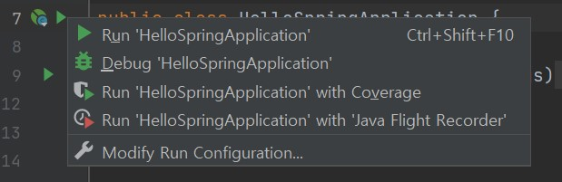
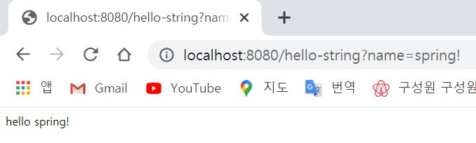
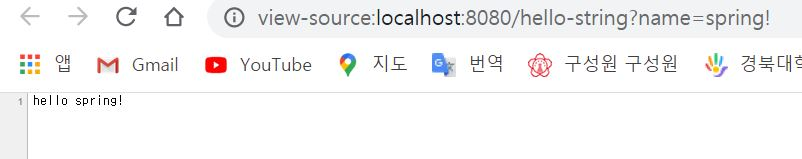
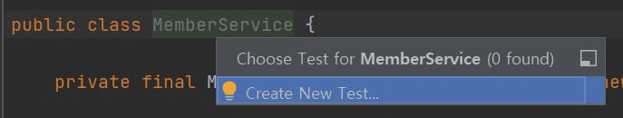

# Spring

https://www.inflearn.com/ ���� '������ �Թ� - �ڵ�� ���� ������ ��Ʈ, �� MVC, DB ���� ���_�迵��' ���Ǹ� ���� �����ߴ�.

---
---
## ���� 0. ���ǼҰ�

---
---

### ������ �� ���ø����̼� ����

- ������ ������Ʈ ����
- ������ ��Ʈ�� �� ���� ����
- ȸ�� ������ ����
- �� MVC ����
- DB ���� - JDBC, JPA, ������ ������ JPA
- �׽�Ʈ ���̽� �ۼ�

---

### ������Ʈ �����

- Spring Boot
- Gradle
- Thymeleaf
- HIBERNATE
- JPA

---

### ���� ��ǥ

- ������ �н��� ����� �� ù ������ ����
- ������ ��� �� ��ü�� �Ÿ� X
- ��� ����ؾ� �ϴ����� ����
- ������ ������ ��� X
- ���̳��� ������ ��� X

---

### ������ ���� ���� ��

- ������ �Թ�
- ������ �ٽ� ����
- ������ �� MVC
- ������ DB ������ ���� ���
- ����! ������ ��Ʈ


---
---

## ���� 1. ������Ʈ ȯ�漳��

---
---

### ������ ��Ʈ ��Ÿ�� ����Ʈ�� �̵��ؼ� ������ ������Ʈ ����

- �������� ������ ������Ʈ�� �عٴں��� ���������, ������ ������ ��Ʈ�� ������� ������ ������Ʈ�� ����.
- https://start.spring.io
  

- Project
  - �ʿ��� ���̺귯���� ���ܼ� ����, �갡 �����ϴ� ����������Ŭ���� �������ִ� ��
  - �������� Maven, ������ Gradle�� �Ѿ�� �߼�
  - 

- Language
  - Java
- Spring Boot
  - ������ ������ �ؾ���
  - SNAPSHOT
    - ����� �ִ� ����
  - M1 ...
    - ���� ������ ������ �ƴ�
  - ���� ������ ���� �� ���� ���ƺ��̴� 2.4.2�� ����
    
- Project Metadat
  - Group
    - ���� ������� ����
  - Artifact
    - ����Ǿ� ���ö� ������ �����(������Ʈ ���� ���)
  - �׿ܴ� �׳� ����
  
- Dependencies
  - �̰� �߿���.
  - Spring boot ������� ������Ʈ�� �����Ұǵ� � ���̺귯���� ���ܼ� ����� ���ΰ��� ���� ����
  - ���⼭�� web project�� ����Ŵϱ� 'spring web'�� 'thymeleaf'�� �߰�
    <br/>
    
    - thymeleaf
      - html�� ������ִ� ���ø� ����.


- �� ��, Generate�� ������ �ٿ�ε带 �ް� �ȴ�.<br/>
    
    - ���� ���ϴ� ������ �ű� �� ������ Ǯ�� '���ڸ�����'���� ����
    - ���� Ǭ ��η� ���� build.gradle�� ������ Open
    - 

---

### ��ġ �� ���ڸ����̿��� ���� ���캸��

- gradle ����
  - gradle ���� ������
- src ����
  - main
    - java
      - ���� package�� �ҽ� ������ ����.
    - resources
      - ���� �ڹ� �ڵ� ������ ������ xml �̳� properties�� ��������, html ���� ������.
  - test
    - test code��� ���õ� �ҽ����� ��.
    - ���� ���� Ʈ���忡�� test code�� �߿���
  - build.gradle
    - �̰� �߿���.
    - ���߿� ���� �����ϰ� ������ gradle�� ���� ������ �ϰ� ���̺귯���� ���ܿ´� ������ ����.
    - 
      - sourceCompatibility = '11' �� Java 11 ������ �ǹ�.
    - dependencies
      - 
      - implementation
        - �Ʊ� �߰��� �͵�
      - testImplementation
        - �⺻������ test ���̺귯���� �ڵ����� ��.
      - 
        - ������ �𸣰����� testImplementation �ؿ� exclude�� �ڵ����� �������־ �׳� ���� ����.
    - repositories
      - �� dependencies�� ���̺귯���� �ٿ�޾ƾ��ϴµ� mavenCentral()�̶�� ������ ����Ʈ���� �ٿ�ε� �޾ƶ��� ������ ��.
  - .gitignore
    - �ҽ��ڵ� �������ִ� ��
    - git���� �ʿ��� �ҽ��ڵ� ���ϸ� �ö󰡰� build�� ������� �ö󰡸� �ȵǴϱ� �����ϴ� ������ start.io���� �� ������ ������
  - settings.gradle
    - ���߿� gradle ��ﶧ �����ϱ�
  
---

### �ѹ� ��������

- 
  - �� ��η� �� ��
- 
  - �̷��� �ڵ���� ���´�.
- 
- ���� �� �̷��� ȭ���� �۵��� ���´�.(�߿�)
  - 
    - �ؿ��� �ι�° �� tomcat���� http�� port 8080���� ��.
- �� ��, localhost:8080 �����ϸ� �Ʒ��� ���� ��.
  - 

- ������� ���������� ������Ʈ ȯ�� ������ ����.
---

### ���̺귯�� ���캸��

�����ϰ� ���캽

- 
  - ������ ������ ����.
  - gradle�̳� maven ���� build ������ �������踦 �� ������ ����
    - ex>�츮�� start.sprnig.io���� �߰��� spring-booter-starter-web�� ����� �̰��� �ʿ��� ���̺귯���� ��Ĺ, spring web, spring MVC �̷��͵��� ���ܿ�(== �������踦 ����)
      - �츮�� spring-booter-starter-web�� �ʿ������� �� spring-booter-starter-web�� �ʿ��� �͵鿡�� ������ �ϰ� �ִ�.
      - �׷��� gradle�� ������ ���� �� ģ������ ���� ���ܿ´�.

- '���ڸ�����' �����ʿ� ���� gradle�� �ִµ� �̰� Ŭ���ϸ� �Ʒ��� ���� ���´�.
  - 
  - Dependencies
    - ���̺귯������� ��������
    - 
      - ���� thymeleaf �� web �� 2���� ���ܿԾ���.
    - 
      - ������ �� ���� ó�� �������� �ʿ��� ���̺귯���� ������ ������ ���� ��� ���ܿ�
    - tomcat
      - web server�� ����� ��
      - �������� WAS(or Web Server)�� ���� ������ ��ġ(tomcat ������), �׸��� �ű⿡ �ڹ� �ڵ带 ����ִ´�.
        - �������� ���� ���̺귯���� �и��� �Ǿ� �־���.
        - �ǰ� ���� �۾������� ���򿡴� �ҽ� ���̺귯������ �������� ����ִ�(==�Ӻ����(Ȥ�� �����ϰ� �ִ�.)) �� ���ุ �ϴµ��� �������� ��.
        - 
- log ����
  - ���������� System.out.println���� ����ϸ� �ȵ� �� log��� �ɷ� ����ؾ���.
    - �׷��� log�� ���ܾ� �ɰ��� �͵��� ���� ���� �� log ������ ���� �����ؼ� �� �� ����.
  - 
    - slf4j == �������̽�
    - ���� log�� � ����ü�� ����� ���ΰ��� ���� logback�� ���� ������.
    - log �����ؼ� �ñ��Ѱ� ������ �� 2���� �˻��ؼ� �˾ƺ���

- test ���� ���̺귯��
  - junit
    - java���� test�Ҷ� junit ���̺귯���� ���� ����Ѵ�.

- ���(�ٽ� ���̺귯�� �� �����ڷῡ ����)
  - ������ ��Ʈ ���̺귯��
    - spring-boot-starter-web
      - spring-boot-starter-tomcat: ��Š(������)
      - spring-webmvc: ������ �� MVC
    - spring-boot-starter-thymeleaf: Ÿ�Ӹ��� ���ø� ����(View)
    - spring-boot-starter(����): ������ ��Ʈ + ������ �ھ� + �α�
      - spring-boot
        - spring-core
      - spring-boot-starter-logging
        - logback, slf4j
  - �׽�Ʈ ���̺귯��
    - spring-boot-starter-test
        - junit: �׽�Ʈ �����ӿ�ũ
        - mockito: �� ���̺귯��
        - assertj: �׽�Ʈ �ڵ带 �� �� ���ϰ� �ۼ��ϰ� �����ִ� ���̺귯��
        - spring-test: ������ ���� �׽�Ʈ ����
---

### View ȯ�漳��

- Welcome Page �����
  - 
  - localhost:8080�� �����ϸ� �Ʒ��� ���� ��.
    
  - hello �� ������ �ƹ��͵� �����Ƿ� ������ ��.
    
- Spring ����� ��û ���� spring.io ���� �ʿ��� �� ã�� �ɷ��� �߿���.
  - ex> Welcome Page ����
    - spring.io �� Project �� Spring Boot �� LEARN �� 2.4.2 ���� Reference Document Ŭ�� �� Spring Boot Features �� ctrl+F �� welcome page �˻�
      
    - �ٵ� �̰Ŵ� ����(static)��.
- ���ø� ����
  - ���ø� ������ ����ϸ� �����̾ƴ� �������� �������� �ٲ� �� ����.
  - ���⼭�� thymeleaf ���ø� ���� ���.
  - thymeleaf ���� ����Ʈ: https://www.thymeleaf.org/
  - ������ ���� Ʃ�丮��: https://spring.io/guides/gs/serving-web-content/
  - ��������Ʈ �޴���: https://docs.spring.io/spring-boot/docs/2.3.1.RELEASE/reference/html/spring-boot-features.html#boot-features-spring-mvc-template-engines


---

### Controler

- 
  - hello.hellospring �ȿ� 'controller' ��� Package ����
    - 'controller' Package�ȿ� 'HelloController' ��� Java Class ����
- Controller Class�� @Controller�� ���� ���������.(�Ʒ� �������� ���� �� 'Controller'��� ������)
  - @�� Annotatino�̶�� ��.
  - 

- 
  - @GetMapping(~~)
  - �� ���ø����̼ǿ��� /hello ��� ������ �Ʒ��� method�� ȣ�����ش�.
- �Ʒ��� ���� �ڵ� �ۼ�
    ```java
    package hello.hellospring.controller;

    import org.springframework.stereotype.Controller;
    import org.springframework.ui.Model;
    import org.springframework.web.bind.annotation.GetMapping;

    @Controller
    public class HelloController {
        @GetMapping("hello")
        public String hello(Model model){
            model.addAttribute("data", "hello!!");
            return "hello";
        }
    }

    ```
- �� ��, src/resources/templetes/ �� hello.html ����
  - 
  - ���� �ڷῡ �ִ� �ڵ� ����
    - 
  
- 
  - xml ��Ű���� ���ø� ������ ������ �Ǿ��ִ� ���.
  - �̷��� ���ø� ������ thymeleaf ������ ����� �� �ִ�.
- 
  - "${data}" �� �Ʊ� Controller�� �ۼ��� model.addAttribute���� key�־��� "data"�� value�� "hello!!"�̴�.
    - ��, "${data}" �� "hello!!"�� ġȯ.
  - 
- 
  - @GetMapping������ Get�� Get / Post �Ҷ� �� Get��
    - http url �� ���Ƿ� ġ�� ����ġ�� �װ� Get ����̶�� ��.
    - �׷��� controller�� �ִ� �ش� method�� ������ ��.
    - Spring�� Model�̶�� ���� ���� �Ű������� �־���.
    - model���ٰ� addAttribute�ؼ� key�� "data", value�� "hello!"�� �־��ش�.
    - �׸��� "hello"�� �������ش�.
      - 
        - return "hello"�� �ǹ̴� resources/templetes/hello�� ���� model�̶�� ���� �Ѱܶ�.
    - mapping ��δ� resources:templates/'+{ViewName}+'.html'�̴�.
- ����: spring-boot-devtools ���̺귯���� �߰��ϸ�, html ������ �����ϸ� ���ָ� ���� ����� ���� View ���� ������ �����ϴ�.
- ���ڸ�J ������ ���: �޴� build Recompile

---

### �����ϰ� �����ϱ�

- ���ǿ����� �� �͹̳η� �����ؼ� ���� wsl2�� ������. �� windown�� wsl2���� java ȯ�溯�� ������ �ȵǾ �׳� cmdâ���� ������(<strong>git bash</strong>�� �ϴ°� �� ���ѵ�)
  - gradlew + enter �� gradlew build + enter
  - �� �� build/libs �� ����
    - 
  - �� ��, java -jar hello-spring-0.0.1-SNAPSHOT.jar �� �Է��ϸ� console���� �� jar ������ ������ ��.
- ��, ������ �����Ҷ��� �� jar ���ϸ� �����ؼ� ������ �ְ� �ű⿡�� java -jar�� �����Ű�� �������� spring�� ������ ��.

- ./gradlew clean build
  - build ������ ������
- 

---
---
## ���� 2. ������ �� ���� ����
---
---

### ���� �����Ѵٴ� ��
  1. ���� ������
     - �������� �� �ϴ°� ���� �׳� ������ �״�� ���������� ������  
  2. MVC�� ���ø� ����
     - ���� ���� �ϴ� ���
     - jsp, php �� �̰͵��� ���ø� ����
     - Model-View-Controller �������� ������ 
     - server���� �����ؼ� <strong>html</strong>�� �ٲ㼭 �����ִ� ���
  3. API ���
     - �ȵ���̵峪 ������ client�� �����ϸ� ���������� <strong>json</strong>�̶�� data format���� ������ 
     - api�� data�� �����ָ� ȭ���� client�� �˾Ƽ� �׸��� �����ϴµ� �̶� api����� ���� ���
     - �������� ����Ҷ� html�� �ְ����� �ʿ� ���� data�� �ְ� �ޱ� ���� �����

---

### ���� ������
  - spring boot�� ���� ������ ����� �⺻������ ����
  - resources/static/ ���� hello-static.html �����ؼ� �����ڷῡ �ִ� �ڵ� ����
  - 
  - 
    - �� ���������� localhost:8080/hello-static.html ġ��<br/> 
      1) ���� ���� ������ ��û�� �ް�
      2) hello-static.html�� �Դٴ� ���� spring���� �ѱ� 
      3) spring�� controller�ʿ��� hello-static�̶�� ���� �ִ��� ã�ƺ���(controller�� �켱������ �����ٴ� ��) 
      4) hello��� controller�� �־����� hello-static�̶�� controller�� ���� 
      5) ������ �� ���� resources:static/hello-static.html �̶�� ���� ã�´�. 
      6) �׷��� �ؼ� ������ �װ��� ��ȯ����

---

### MVC�� ���ø� ����

  - MVC == Model-View-Controller
  - ���ſ��� controller�� view�� ���� �и��Ǿ� ���� �ʰ� view���� ������ ����
    - jsp�� asp �׷��� ���� ��
    - �̸�, Model one ����̶�� ��
    - �̷����ϸ� �������� �ʹ� �����. view ���Ͽ��� ��õ ���� �ڵ尡 �ȴ�.
  - ���򿡴� MVC ������� ���� ��.
    - ���ɻ縦 �и��ؾ��ϱ� ������(���Ұ� å��)
    - View�� ȭ���� �׸��µ��� ����
    - Model �̳� Controller�� ���� business logic�̳� �������� ��(�鿣��)�� ó���ϴµ� ����.
    - �׷��� �鿣�忡�� ó���� �Ͽ��� ȭ��(View)���� �ʿ��� �������� model�̶�� �Ϳ� ��Ƽ� �Ѱ��ִ� ������ ���� ���.
- 
  - ���⼭ hello! empty�� ���ø� �������μ� ������ �ϸ� ������ ������ ������ ġȯ, ���ø� �������μ� ������ ���ϸ�(�������� ������ ��η� ���� �� ���) hello! empty ���

- controller���ٰ� �߰���
    ```java
    @GetMapping("hello-mvc")
        public String helloMvc(@RequestParam("name") String name, Model model){
            model.addAttribute("name",name);
            return "hello-template";
        }
    ```
    �� �Է��ϰ�, localhost:8080/hello-mvc�� ġ�� ������ ��.
    - ������ ���� �ϴ� log�� ������.
      - 
      - 
    - @RequestParam("name")���� Ŀ�� �̵� �� Ctrl+P ������ �Ķ���� ������ �� �� ����
  - localhost:8080/hello-mvc?name=spring�� �Է��ϸ� http GET ��Ŀ��� ? ~~~ �� parameter�� �Ѱ��� �� ����.
    - �׷��� name�� spring�� �Ѱ��־ ������ ���� ����� ���´�.
    - 
  - 
    - ������������ localhost:8080/hello-mvc�� �ѱ��
      1) ���� ���� ������ ���ļ� spring���� hello-mvc��� ���� �Դٰ� ������
      2) spring�� helloController�� �� method�� mapping�� �Ǿ� �־ �� method�� ȣ�����ش�
      3) return�� "hello-template" model(name:spring) �̷��� spring���� �Ѱ��ش�
      4) viewResolver(ȭ��� ���õ� �ذ���, view�� ã���ְ� ���ø� ������ ���� ������)�� templates/hello-template.html�� ã�Ƽ� thymeleaf ���ø� ������ ó���ش޶�� �ѱ�.
      5) ���ø� ������ �������� �ؼ� ��ȯ�� �� html�� �� �������� ��ȯ�� �Ѵ�.(�����϶��� �̶�, ��ȯ�� ���� �ʰ� ��ȯ)
  - 

---

## API ���

- �ϴ� �ڵ�
  - ���������� controller�� �Ʒ� �ڵ� �߰�
    ```java
    @GetMapping("hello-string")
    @ResponseBody
    public String helloString(@RequestParam("name") String name){
        return "hello " + name;
    }
    ``` 
    - @ResponseBody�� http ��� �������ݿ��� header�� body�� �ִµ� body�� �� data�� ���� ���� �־��ְڴٶ�� ��.(html������ body �±װ� �ƴ�)
    - ���ø� �������� ���̴� View �̷��� ���� ���ڰ� �״�� ������.
    - �����ϸ� �Ʒ��� ���� ����.
        
    - �ڵ带 ���� �̷��� ����
        
        - �׳� ���ڰ� �״�� ������.(��, view ���� �״�� ������)
        - �ٵ� �̷��Դ� ���� �� �� ����
- ���� data�� ����� ��(�̰� ������ api ����� ���� ���)
  - �ϴ� �ڵ�
    ```java
    @GetMapping("hello-api")
    @ResponseBody
    public Hello helloApi(@RequestParam("name") String name){
        Hello hello = new Hello();
        hello.setName(name);
        return hello;
    }

    static class Hello{
        private String name;

        public String getName() {
            return name;
        }

        public void setName(String name) {
            this.name = name;
        }
    }
    ``` 
    - return�� class�� �Ѱ��ش�.
    - class���� getter�� setter�� �־�� �ϴµ� �̴� alt+insert(������ ��� alt+function+delete)�� �����༭ getter and setter Ŭ��
    - ������, ���ڸ����̿��� �ڵ��ϼ� ����Ű�� ctrl+shift+enter �̴�.
    - getter, setter �� java bin �Ծ��̶�� ��
      - private String name ���� ��� private�̴ϱ� �ܺο��� �� �����ϱ� �ܺο��� ����ҷ��� �̷��� getter�� setter�� ���ؼ� ������ �ϰ� ��.
      - property ���� ����̶���� ��.
  - �� �� �����ϸ�, �Ʒ��� ���� ����
    - 
      - json�̶� ������ �����ϸ� key:value�� �̷���� ����.
  - spring ���� ��� ��ü�� ��ȯ�ϰ� @ResponseBody�� ����θ� �׷��� json���� ��ȯ�ϴ°� default��.(xml���ε� �� ���� ����. �ٵ� ������ �� �Ȼ���Ѵ�.)

- @ResponseBody ��� ����
  - 
    - �� ���������� ���� localhost:8080/hello-api�� �Է��ϸ�
      1) ���� ���� �������� hello-api�� �Դٰ� spring���� ����.
      2) spring�� controller�� hello-api�� ã�� ã�Ҵµ� @ResponseBody��� annotation�� �پ�������(�� �پ� ������(��, ���ø� �������) viewResolver���� ������) �̶� ��ȯ�ϴ� ���� ��ü�� ���� json ������� �����͸� ���� http ���信 ��ȯ�ϰڴ�(�̰� �⺻ ��å)<br/>
      return: hello(name:spring)
      3) HttpMessageConverter��� ���̰� ������ ��.
         1) �ܼ� �����̴� �� StringConverter�� ����(���� �̸��� StringHttpMessageConverter)
         2) ��ü�̴� �� JsonConverter�� ����(���� �̸��� MappingJackson2HttpMessageConverter)
            - ��ü�� json ��Ÿ�Ϸ� �ٲ۴�.
            - Jackson�̶� ��ü�� json���� �ٲ��ִ� ���̺귯��
              - ��ü�� json���� �ٲ��ִ� ������ ���̺귯���� jackson�� gson�� �̷��� �ִ�.
      4) �ٲ� json�� ��û�� ���� Ȥ�� ������������ �ش�.

- ����
  - ���� ������
    - �׳� ������ �״�� �����ش�.
  - MVC �� ���ø� ����
    - ���ø� ������ Model-View-Control ������� �ɰ��� ���� View�� ���ø� �������� html�� �������ؼ� �������� �� html�� client���� �������ش�.
  - API
    - ��ü�� ��ȯ�ؼ� httpmessageconverter�� ���ؼ� json ���Ϸ� ��ȯ �� ��ȯ�� ����
    - view �̷��� ���� �ٷ� http response�� �ٰ� �ٷ� ��.

---
---
## ���� 3. ȸ�� ���� ���� - �鿣�� ����
---
---

- ����Ͻ� �䱸���� ����
- ȸ�� �����ΰ� �������丮 �����
- ȸ�� �������丮 �׽�Ʈ ���̽� �ۼ�
- ȸ�� ���� ����
- ȸ�� ���� �׽�Ʈ ( �� junit�̶�� test �����ӿ�ũ�� �������)

---

### ����Ͻ� �䱸���� ����

�����ϰ� �ϰ���.
- ������: ȸ�� ID, �̸�
- ���: ȸ�� ���, ��ȸ
- ������ �ó�����: ���� ������ ����Ұ� �������� �ʾҴ�.
  - ex> �����ڰ� ������ �ؾ��ϴµ� DB�� ������ �ȵǾ��� ���(DB�� ������ DB�� ����, NoSQL�� ����, ������ �߿��� DB�� ���� ��)�ε��� ������ �ؾ��ϴ� ���

- 
  - ��Ʈ�ѷ�
    - �� MVC�� ��Ʈ�ѷ��� ����
  - ����
    - �ٽ� ����Ͻ� ���� ����
    - EX> ȸ���� �ߺ������� �ȵȴ�.
  - ������
    - ȸ��, �ֹ�, ���� ��� ó�� �ַ� �����ͺ��̽��� �����ϰ� �����Ǵ� ����Ͻ� ������ ��ü
  - ����
    - ����Ͻ� ������ ��ü�� ������ �ٽ� ����Ͻ� ������ �����ϵ��� ������ ����

- Ŭ���� ��������
  - 
    - ȸ�� �����Ͻ� �������� MemberService�� �ִ�.
    - ȸ���� �����ϴ� MemberRepository�� interface�� ����.
      - Why? ���� ������ ����Ұ� �������� �ʾƼ�
    - ����ü�� Memory ����ü�� ���� ����
      - �ϴ� ������ �ؾ��ϴϱ� memory ���� �ܼ��ϰ� ����� ���� ��ü���ΰ� �����Ǹ� �ٲ� �����(�׷��Ƿ� interface�� �ʿ�)
  - ���� ������ ����Ұ� �������� �ʾƼ�, �켱 �������̽��� ���� Ŭ������ ������ �� �ֵ��� ����.
  - ������ ����Ҵ� RDB, NoSQL ��� �پ��� ����Ҹ� �������� ��Ȳ���� ����
  - ������ �����ϱ� ���ؼ� �ʱ� ���� �ܰ迡�� ����ü�� ������ �޸� ����� ������ ����� ���

---

### ȸ�� �����ΰ� �������丮 �����

- �ϴ� �ڵ�
  - domain package �����
    - Member��� Class ����
      - id�� name�� �ִ�.
        - ���� getter setter ����
  - repository package �����
    - Member ��ü�� �����ϴ� ����Ҹ� ����
    - 
    - ���� ��ɵ�
      ```java
      public interface MemberRepository {
          Member save(Member member);
          Optional<Member> findById(Long id);
          Optional<Member> findByName(String name);
          List<Member> findAll();
      }
      ```
    - Optional
      - Java8�� �� ���
      - findById�� findByName���� �������� ���� �� �� �ִ�. �׷��� NULL�� ��ȯ������ ���򿡴� NULL�� ó���ϴ� ������� NULL�� �״�� ��ȯ�ϱ⺸�ٴ� Optional�̶�� ������ ���μ� ��ȯ�ϴ� ���� ��ȣ.
    - �׷� ��, �� �����(repository package)���� findById�� findByName���� ã�ƿ� ���� �ְ�, findAll�� ���ݱ��� ����� ��� ȸ�� ����Ʈ�� ��ȯ�ϵ��� �����ҰŴ�.
  - ����ü �����
    - 
    interface�� �����ؾ���
    ```java
    ``` 
      - save�� �Ҷ� ��򰡿� �����ؾ���
        ```java
        private static Map<Long, Member> store = new HashMap<>();
        ``` 
        - �ǹ������� ���ü� ������ ���� �� �־ �����Ǿ����� �����϶��� HashMap ��� ConcurrentHashMap�� ����ؾ���.
      - 0,1,2 �̷��� key ���� �������ִ� ����
        ```java
        private static long sequence = 0L;
        ``` 
        - �ǹ������� ���ü� ���������� long ���ٴ� �ٸ� �� ���
      - save
        ```java()
        @Override
        public Member save(Member member) {
            member.setId(++sequence);
            store.put(member.getId(), member);
            return member;
        }
        ``` 
        - store���ٰ� �ֱ� ���� member�� id ���� setting(�̸��� save�ϱ����� �Ѿ�Դ� ������)
        - �� �� store���ٰ� ����(Map�� ������ ��)
        - ����� ����� ��ȯ.
      - findByID()
        - store���� �׳� ������ ��.
        - �ٵ� ��ȯ ���� NULL�� ��찡 ���� ���� ������ Optional�� ���μ� ��ȯ�ؾ���. �� �׷��� client���� �� �� ���� ����.
        ```java
        @Override
        public Optional<Member> findById(Long id) {
            return Optional.ofNullable(store.get(id));
        }
        ``` 
      - findByName()
        ```java
        @Override
        public Optional<Member> findByName(String name) {
            return store.values().stream()
                .filter(member -> member.getName().equals(name))
                .findAny();
        }
        ``` 
        - ���� ���Ŵ� java8 ���� �����.
        - Map.values().stream() �� loop�� ������ ����
        - .filter(member -> member.getName().equals(name)) : parameter�� ���� "name"�� ������ Ȯ��
        - .findAny(); : �� �� �ϳ��� ã���� �� ����� Optional�� ��ȯ
        - �ٵ� ������ loop ���ȴµ� ������ Optional�� NULL ������ �Ǿ ��ȯ.
      - findAll()
        ```java
        @Override
        public List<Member> findAll() {
            return new ArrayList<>(store.values());
        }
        ``` 
        - �ڹ� �ǹ������� List�� ���� �����.
          - loop ������ ���ϰ� �ؼ�
        - store�� �ִ� values�� Member���̴ϱ� Member���� ��ȯ�� ��.
  - �̷��� ������ ����ü���� �� �۵��ϴ� �����ؾ���.
    - test case�� �ۼ��ؼ� �����ϱ�.

---

### ȸ�� �������丮�� �׽�Ʈ ���̽� �ۼ�

    ������ ����� �����ؼ� �׽�Ʈ �� �� �ڹ��� main �޼���� ���ؼ� �����ϰų�, �� ���ø����̼��� ��Ʈ�ѷ��� ���ؼ� �ش� ����� �����Ѵ�. �̷��� ����� �غ��ϰ� �����ϴµ� ���� �ɸ���, �ݺ� �����ϱ� ��ư� ���� �׽�Ʈ�� �ѹ��� �����ϱ� ��ƴٴ� ������ �ִ�. �̸� �ذ��ϰ��� �ڹٴ� JUnit�̶�� �����ӿ�ũ�� �׽�Ʈ�� �����ؼ� �̷��� ������ �ذ��Ѵ�.
- �Ʒ��� ���� test�� repository������ test�� Ŭ������ ������ش�.
  - 
- @Test�� �����ָ� �� �Ʒ� method�� ������ �� ����
  ```java
  class MemoryMemberRepositoryTest {

    MemberRepository repository = new MemoryMemberRepository();

    @Test
    public void save(){
        Member member = new Member();
        member.setName("spring");

        repository.save(member);

        Member result = repository.findById(member.getId()).get();
        //System.out.println("result = " + (result == member));
        //Assertions.assertEquals(member,result); //org.junit.jupiter.api
        Assertions.assertThat(member).isEqualTo(result); //org.assertj.core.api
    }
  }
  ```
    - Optional���� ���� �������� .get()
    - System.out.println���� �ص� �dz� ���ڸ� ��� �� ���� �����ϱ�
- save() method test ����
  - Case1) org.junit.jupiter.api
    - �츮�� ����ϴ� ��(member)�� find���� ������ Ƣ��;���.
    - 
    - ���� �� �ʷϺ�
      - 
    - ���� �� ������
      
  - Case2) org.assertj.core.api(�̰� �� ���� ���)
    - ��� �������� �� member�� result �Ȱ���?
    - 
      ```java
      assertThat(member).isEqualTo(result);
      ``` 
      �̷��� ����ǰ� �������ʹ� �׳� assertThat���� ġ�� ��.
    - ���������� ������ �ʷϺ�, ���н� ������

Tip: Shift + F6�� ������ �� �Ʒ��� �ִ� �͵� Rename��.
- findByName() method test ����
  - �Ϻη� ����
    ```java
    @Test
    public void findByName(){
        Member member1 = new Member();
        member1.setName("spring1");
        repository.save(member1);

        Member member2 = new Member();
        member2.setName("spring2");
        repository.save(member2);

        Member result = repository.findByName("spring1").get();

        assertThat(result).isEqualTo(member1);
    }
    ```
    - �� test ��� "spring1"�� �������� result�� member1(setName���� spring1 ����)�̹Ƿ� ����
    
  - �Ϻη� ����
    ```java
    @Test
    public void findByName(){
        Member member1 = new Member();
        member1.setName("spring1");
        repository.save(member1);

        Member member2 = new Member();
        member2.setName("spring2");
        repository.save(member2);

        Member result = repository.findByName("spring2").get();

        assertThat(result).isEqualTo(member1);
    }   
    ```
    - �� test ��� "spring2"�� �������� result�� member2�̴�.
    - �׷��Ƿ� member1�� �ٸ��Ƿ� ����.

- Class �� method ���� Test
  - 
  - class �� �ʷϹ�ư ������ run �ϸ� ��.
  - 
    - �� �� ���� �۵��ϴ� ���� Ȯ���� �� �ִ�.

  - findAll() method Test ����
    - 
    ```java
    @Test
    public void findAll(){
        Member member1 = new Member();
        member1.setName("spring1");
        repository.save(member1);

        Member member2 = new Member();
        member2.setName("spring2");
        repository.save(member2);

        List<Member> result = repository.findAll();

        assertThat(result.size()).isEqualTo(2);
    }
    ```
      - 
        - �� method�� ���������� test ������ ������ ���
    - ������ class�� test�� ��� error�� ����.
      - 
        - test ������ ������ �ȵ�.
          - ��� test�� ������ ��� ���� method���� ���� �����ϰ� ���踦 �ؾ���.
        - �� ������ ������, findAll()�� ���� ������ ��
          - �̶�, "spring1"�� "spring2"�� ������ �Ǿ����.
            - �׷��� findByName()�� �Ҷ� ���� �ٸ� ��ü(������ ������ "spring1" ��ü)�� ���͹���.
        - �׷��� ��� �ؾ��ϴ°�?(�߿�)
          - test�� �ϳ� ������ data�� ����ϰ� clear�������. 
          - MemoryMemberRepository()�� test�ϴ� �Ŵϱ� ������ �������̽��� �ƴ� MemoryMemberRepository�� �ٲٱ�.
            - 
            ```java
            MemoryMemberRepository repository = new MemoryMemberRepository();
            ```
          - �� ��, main/repository�� ���� ����ü�� �ٰ� clear���ִ� method �߰�
            - 
            ```java
            public void clearStore(){
                store.clear();
            }
            ```
              - store�� �����
          - @AfterEach (�ٽ� test�� �Ѿ�ͼ�)
            - ��� method�� ������ ������ ���� ������ ��.(call-back method) 
            - 
            ```java
            @AfterEach
            public void afterEach(){
                repository.clearStore();
            }
            ```
              - test�� ������ �ǰ� ���������� �ѹ��� ����Ҹ� clear ���� == test ������ ����� ������
              - 
                - ���� ������ ���
        - ���
          - test�� ���� ������ �������(���� �����������) ���谡 �Ǿ�� �Ѵ�.
          - �׷��� ���ؼ��� �ϳ��� test�� ���������� ���� ����ҳ� ���� �����͵��� ������� ������ ����.

- �̷��� ���� ������ �� ����(MemoryMemberRepository)�� �޿� ������ ���� ��, Test�� �ۼ��� ���� �ְ�,
- �ݴ��, Test class�� ���� �ۼ��� �� ��, ���� �� ��(MemoryMemberRepository)�� �ۼ��� �� �� �� �ִ�.
  - �̸� ������ �� �ִ� Ʋ�� �����, �� �� ���� ��������� �� Ʋ���ٰ� �� ���������� �˻�.
  - TDD(�׽�Ʈ �ֵ� ����)�̶�� �Ѵ�.
  - ��, test�� ���� �� ���� class�� ���� �� test�غ���.

- ���� test �ؾ��Ұ� ���ٸ�?
  - 
  - �ƴϸ� gradlew �� test�ϱ�.

- �� test code�� ���� �����Ҷ��� ��ȥ�ڴ� �������� ���������� ���� ������ �Ҷ�, �� �ҽ��ڵ尡 ��������� test code���� �����ϴ°� ���� �Ұ���.

---

### ȸ�� ���� ����

- ȸ�� ���� Ŭ���� �����
  - ȸ�� ���񽺴� ȸ�� �������͸��� �������� Ȱ���ؼ� ���� �����Ͻ� ������ �ۼ��ϴ� ��

- service repository �����
  - MemberService Class ����
    - ȸ�� ���񽺸� ������� MemberRepository�� �־����
      ```java
      private final MemberRepository memberRepository = new MemoryMemberRepository();
      ``` 
    - ȸ�� ���� �����
      - memberRepository���� save�� ȣ���ϸ� ��.
      - �׸��� ���Ƿ� member�� Id ��ȯ�ϵ��� ��.
      - �ٵ� �����Ͻ� ���� �� ���� �̸��� ȸ���� ������ �ȵȴ�! ��� ��Ҵ�
      - result�� ���� ���� ������, �� member�� ���� ������ "�̹� �����ϴ� ȸ���Դϴ�"��� throw�Ѵ�.
        - ifPresent�� null�� �ƴ϶� � ���� ������ ������ ��. Optional�̶� ������.
      ```java
      public Long join(Member member){
        //���� �̸��� �ִ� �ߺ� ȸ��x
        // ����� ���
        memberRepository.findByName(member.getName())
            .ifPresent(m -> {
                throw new IllegalStateException("�̹� �����ϴ� ȸ���Դϴ�.");
            });
        // �̷��Դ� �� ����
        Optional<Member> result = memberRepository.findByName(member.getName());
        result.ifPresent(m -> {
            throw new IllegalStateException("�̹� �����ϴ� ȸ���Դϴ�.");
        });

        memberRepository.save(member);
        return member.getId();
      }
      ``` 
      - �׷���, findByName���ؼ� ��� logic�� ������ ��ó�� �̷� ��쿡�� methodȭ �ϴ°��� ����.
        - methodȭ �� �κ� �巡�� ��, ctrl + alt + m �ؼ� �̸� �����ָ� �ڵ����� method ����
        ```java
        public Long join(Member member){
        //���� �̸��� �ִ� �ߺ� ȸ��x
        // ����� ���
        validateDuplicateMember(member);
                memberRepository.save(member);
                return member.getId();
       }

        private void validateDuplicateMember(Member member) {
            memberRepository.findByName(member.getName())
                .ifPresent(m -> {
                    throw new IllegalStateException("�̹� �����ϴ� ȸ���Դϴ�.");
                });
        }
        ```
    - ��ü ȸ�� ��ȸ�ϴ� ���
      ```java
      /*
      ��ü ȸ�� ��ȸ
      */
      public List<Member> findMembers(){
          return memberRepository.findAll();
      }
      ``` 
    - �Ѹ��� ȸ�� ��ȸ ���
    ```java
    /*
    �Ѹ� ȸ�� ��ȸ
     */
    public Optional<Member> findOne(Long memberId){
        return memberRepository.findById(memberId);
    }
    ``` 
  - �ߺ��� repository�� �׳� �ܼ��� ����ҿ� ���� �־����ϴ� ����, service class�� �� �� �����Ͻ��� �����(join,findmembers ��.). �׷��� Service Class�� �����Ͻ��� ����� �������� �ؾ���.

  - ������ ȸ������ ������ �ߺ� ȸ���̸� ������ �߻�(exception�� ����)�ϴ� �� ������ �غ�����.
    - test case�� Ȱ���Ͽ� ����
- tip : ctrl + alt + v �ϸ� �Լ��� ��ȯ ���� ����.

---

### ȸ�� ���� �׽�Ʈ

ȸ�� ���� Ŭ������ �׽�Ʈ�غ���.

- ������ Ŭ������ ����Ű�� �̿��ؼ� ���ϰ� test code �����.
  - ctrl + shift + t
  - 
  - 
  - 

- test code���� method�� �̸��� ������ �ѱ۷� ��� ��.
- ȸ�� ������ �ҷ��� Service�� �־����.
  ```java
  MemberService memberService = new MemberService();
  ``` 
- test�� �̷��̷��� ��Ȳ�� �־�����(given) ��� ���� ����������(when) ����� �̰� ���;� ��!(then) ���� �̷������.
  - given - when - then ����
    - given : �̷��� data�� ������� �ϴ±���
    - when : �̷��� ���� �����ϴ� ����
    - then : ���Ⱑ ���������̱���
- ȸ������ test
  ```java
  class MemberServiceTest {

    MemberService memberService = new MemberService();

    @Test
    void ȸ������() {
        //given
        Member member = new Member();
        member.setName("hello");

        //when
        Long saveId = memberService.join(member);

        //then
        Member findMember = memberService.findOne(saveId).get();
        assertThat(member.getName()).isEqualTo(findMember.getName());
    }
  ``` 
  - !(success_join)(./readme_img/success_join.JPG)
    - ���������� ������ ���
    - ������ test�� ���� flow���� �����ϴ� �͵� �߿������� ���� flow�� �ξ� �� �߿���.
      - join�� �ٽ��� �ߺ� ���Կ� ���� ���ܰ� ���������� test�ؾ���.
  - ���ܺκ� test
    - ��� 1) try - catch
      ```java
      @Test
      public void �ߺ�_ȸ��_����(){
        //given
        Member member1 = new Member();
        member1.setName("spring");

        Member member2 = new Member();
        member2.setName("spring");

        //when
        memberService.join(member1);    //�̶������� ���� ����� ��
        try {
            memberService.join(member2);    //�̶� ���ܰ� ��������.
            fail(); //���ܰ� ������ �ʾƼ� ����!
        } catch (IllegalStateException e){
            assertThat(e.getMessage()).isEqualTo("�̹� �����ϴ� ȸ���Դϴ�.");
            //���ܰ� ������ ���������� ������ ���.
      }
      ``` 
    - ��� 2) assertThrows(~~~) (��õ)
      - ��� logic�� �� �� memberService.join(member2)�� ������ IllegalStateException�� class�� �߻��ؾߵ�.
      ```java
      @Test
      public void �ߺ�_ȸ��_����(){
        //given
        Member member1 = new Member();
        member1.setName("spring");

        Member member2 = new Member();
        member2.setName("spring");

        //when
        memberService.join(member1);    //�̶������� ���� ����� ��
        assertThrows(IllegalStateException.class,() -> memberService.join(member2));
      }
       ``` 
      - ��ȯ�ϴ� ���ڰ� ������ Ȯ��
        ```java
        //when
        memberService.join(member1);    //�̶������� ���� ����� ��
        IllegalStateException e = assertThrows(IllegalStateException.class, () -> memberService.join(member2));
        assertThat(e.getMessage()).isEqualTo("�̹� �����ϴ� ȸ���Դϴ�.");
        ``` 
  - ������, ȸ�����԰� �ߺ�_ȸ��_���ܸ� ���ÿ� test�ϸ� ������.
    - clear�� �������. �׷��� memberService�ۿ� �����Ƿ� MemoryMemberRepository �����;���
    ```java
    MemoryMemberRepository memberRepository = new MemoryMemberRepository();

    @AfterEach
    public void afterEach(){
        memberRepository.clearStore();;
    }
    ``` 
    - ���������� ������.
  - �ٵ� test�� �Ҷ� ���� �ٸ� �ν��Ͻ��� test�� �ϴ°��� �ٶ��������� ����. ���� repository�� test�� �ؾ� �´°���
    ```java
    MemberService memberService = new MemberService();
    MemoryMemberRepository memberRepository = new MemoryMemberRepository();
    ```
    - �ذ��
      - MemberService�� ���� �Ʒ��� ���� �ۼ�
        ```java
        private final MemberRepository memberRepository;

        public MemberService(MemberRepository memberRepository) {
            this.memberRepository = memberRepository;
        }
        ``` 
      - ��, memberRepository�� ���� new�� ���� ����� ���� �ƴ� �ܺο��� �־��ֵ��� �ٲ�.
      - test�� �Ѿ�ͼ� �ڵ� ����
        ```java
        MemberService memberService;
        MemoryMemberRepository memberRepository;

        @BeforeEach
        public void beforeEach(){
            memberRepository = new MemoryMemberRepository();
            memberService = new MemberService(memberRepository);
        }
        ``` 
        - @BeforeEach�� method ���� ���� ���� ������.
        - ��, test�� �����ϱ����� ���� ������ ����.(test�� ���������� ������ �Ǿ���ϱ� ������)
        - MemberService���忡�� ����, �ڱⰡ ���� new ���� �ʰ� �ܺο��� memberRepository�� �־��ش�.<strong>(== �̷��� ����� Dependencies Injection, DI)</strong>��� �Ѵ�.
          1) MemoryMemberRepository�� �����
          2) �� ���� ���� memberRepository�� �־�ΰ�
          3) MemberService(memeberRepository)�� ���� �־��ش�.
          4) �׷���, ���� MemoryMemberRepository�� ����� �Ǵ� ���̴�.
         

---
---

## ���� 4. ������ ��� ��������

---
---

### ������Ʈ ��ĵ�� �ڵ� �������� ����

- ���ݱ����� MemberService, Repository, Member ��ü�� �������, Service�� ���ؼ� Member�� ������ �� �ְ� Repository�� ������ �ǰ� Repository���� ������ �� �ִ� �������� �����, test�� ���������.<br/>

- ȭ���� ���̰� ������ �׷����� controller�� view template�� �ʿ��ϴ�. ȸ�������ϰ� ȸ�����Ե� ����� html�� �ѷ��ִ� ��.
- �̸� �ҷ���, membercontroller�� �������ϴµ� membercontroller�� memberService�� ���ؼ� ȸ�������ϰ� memberService�� ���ؼ� data�� ��ȸ�� �� �־���Ѵ�.
- �׷��� �Ǵ°��� <strong>'membercontroller�� memberService�� �����Ѵ�'</strong>��� ǥ���Ѵ�.

- memberController ����
  - 
    ```java
    package hello.hellospring.controller;

    import org.springframework.stereotype.Controller;

    @Controller
    public class MemberController {

    }
    ``` 
    - �̷��� ����� ������ ����� �ƹ��͵� ������, spring�� ó�� �����Ҷ� spring �����̳ʶ�� ���� ����µ� �ű⿡ @Controller �� ������ �ش� class ��ü�� ����(���⼭�� MemberController)�� �ؼ� spring�� �־��ְ� spring�� ������ �Ѵ�.
      - �̷��� ������, <strong>'spring �����̳ʿ��� spring bin�� �����ȴ�.'</strong>��� ǥ���� �Ѵ�.
  - ��¶�� memberController�� ���� memberService�� �����ٰ� ����ؾ���.
    - spring�� ������ �ϰ� �Ǹ�, �� spring �����̳ʿ� ����� �ϰԵǰ� spring �����̳ʷκ��� �޾Ƽ� ������ �ٲ���Ѵ�.
      - ����, new�� �ؼ� �� ����� ������, MemberController���� �ٸ� ���� controller���� MemberService�� �����ٰ� �� �� �ִµ�, ��� ��� �ϳ��� �����س��� �������� ����ϸ� ��.
        ```java
        public class MemberController{
          private final MemberService memberService = new MemberService();
        }
        ``` 
      - <strong>�׷��� �� ������� ����ϴ� �� ���ٴ�, spring �����̳ʿ� ������ϰ� ����ϸ� ��.</strong>
        - spring �����̳ʿ� ����ϸ� �� �ϳ��� ����� �Ǹ�, �� �� ���������� �ΰ����� ȿ���� �� �� ����.
        - �����ڸ� ����� ���� @Autowired Annotation ����
          - �� MemberController�� spring�� �� �� ������ �ϴµ�, �׷��� �̶� �����ڸ� ȣ���� �ϴµ� �����ڿ� @Autowired�� �Ǿ������� spring �����̳ʿ� �ִ� MemberService�� �����ٰ� ������ ������.
            ```java
            @Controller
            public class MemberController {

                private final MemberService memberService;

                @Autowired
                public MemberController(MemberService memberService){
                    this.memberService = memberService;
                }
            }
            ``` 
          - �׷��� �̷��� ������ ������.
          - �ֳ��ϸ� MemberService�� ���� MemberService�� ������ java Class�̴�. ��, spring�� �� �� �ִ� ����� ����.(annotation�̷��͵� �����ϱ�)
            - �׷��� MemberService���ٰ� @Service �� ����.
            ```java
            @Service
            public class MemberService {
              ~~~
            }
            ``` 
            - @Service�� spring�� �㶧, spring �����̳ʿ� service�� �������.
          - repository�� ���������� @Repository ����
            ```java
            @Repository
            public class MemoryMemberRepository implements MemberRepository{
              ~~~
            }
            ``` 
- Controller, Service, Repository�� ����ȭ�� �����̴�.
  - controller�� ���ؼ� �ܺ� ��û�� �ް�,
  - service���� �����Ͻ� ������ �����,
  - repository���� �����͸� ������
  - �̷��� �͵��� annotation�ϸ�, spring�� �㶧 controller, service, repository�� �����̳ʷ� �����´�.
  - �׸���, �Ʒ� �׸�ó�� controller�� service�� ��������־���Ѵ�.
    - 
  - �� ��������ٶ� @Autowired�� ����ϸ� �����̳ʿ��� ������ �ȴ�~.
    ```java
    @Controller
    public class MemberController {

      private final MemberService memberService;

      @Autowired
      public MemberController(MemberService memberService){
          this.memberService = memberService;
      }

    }
    ``` 
    - ��, �����ڿ� @Autowired�� ����, MemberController�� ������ �� ��, Spring bin�� ��ϵǾ� �ִ� MemberService ��ü�� �����ٰ� �־��ش�.
      - �̷��� ����� Dependencies Injection�̶�� �Ѵ�.
      - �������踦 �����Ѵ�.(spring�� ����)
    - MemberService�� MemberRepository�� ���������� ����.
      ```java
      @Autowired
      public MemberService(MemberRepository memberRepository) {
          this.memberRepository = memberRepository;
      }
      ```
      - spring�� �� ��, Service�� ����� �ϸ鼭 �����ڸ� ȣ���ϴµ� @Autowired�̹Ƿ� Ȯ���ϸ鼭 MemberRepository�� �ʿ��ϴٰ� �ν��Ͽ� spring �����̳ʿ� �ִ� MemberRepository�� �־��ش�.
      - ���ݰ��� ���, MemoryMemberRepository�� ����ü�� �����Ƿ� MemeryMemberRepository�� Service�� ������ ���ش�.
      - memberService�� memberRepository�� �ʿ��ϴ�.
    - �׷���, 3���� ������ ��.

- ����, main�� �������� �������� ���ư�(==�����̳ʿ��� �����ϴ� ���� ������ ���ٸ� �ǹ�)

---

### ����
  - ������ ���� ����ϴ� 2���� ���(2������ ���� �˾ƾ� ��.)
    1. ������Ʈ ��ĵ�� �ڵ� �������� ����
       - ������ �� ��� (@Controller, @Service ,@Repository)�� �� �����.
       - @Component �� ������ spring bin���� �ڵ� ����� ��.
         - spring�� ����ϸ� ������ �͵��� spring bin���� ����� �ؼ� �����.
       - @Controller �� spring bin���� �ڵ� ��ϵ� ������ ������Ʈ ��ĵ �����̴�.
       - @Component�� �����ϴ� ���� Annotation�� spring bin���� �ڵ� ����� �ȴ�.
         - @Controller
         - @Service
         - @Repository
      - �׷���, �ƹ������� @Component�� �����ϸ� �dz�?
        - No
        - hello.hellospring���� �����ؼ� �� ���� �������� �����鼭 spring bin���� ����ϴµ�, ���� �������� �ƴ� ��쿡�� spring bin���� ����� ���ϱ� ����.
          - 
          - �� ���� ó�� demo ������ hello.hellospring�� ���� ������ �ƴϹǷ� ������Ʈ ��ĵ�� ����� �ȵǹǷ� spring bin�� ����� �ȵ�.
      - ����
        - spring�� spring �����̳ʿ� spring bin�� ����� ��, �⺻���� �̱���(��, �ϳ���)���� ����Ѵ�.(�����ϰ� �ϳ��� ����ؼ� ������.)
        - ����, ���� spring bin�̸� ��� ���� �ν��Ͻ��̴�.
        - �������� �̱����� �ƴϰ��ϴ� ����鵵 ������, Ư���� ��츦 �����ϸ� ��κ� �̱����� ����Ѵ�.

    2. �ڹ� �ڵ�� ���� ������ �� ����ϱ� 
       - 
       - memberservice
        ```java
        @Configuration
        public class SpringConfig {

            @Bean
            public MemberService memberService(){
                return new MemberService();//�ٵ� �����ڿ� ���𰡸� �־������.
            }
        }
        ``` 
          - �̷����ϸ� spring�� �㶧, @Configuration�� �а�, �̰Ŵ� spring bin�� ����϶�� ���̳��ϰ� spring�� ����� ��.
          - �׷��鼭 memberService()�� �ش� ������ ȣ���ؼ� spring bin�� ����� ����.
        - memberRepository
          ```java
          @Bean
          public MemberRepository memberRepository(){
              return new MemoryMemberRepository();
          }
          ``` 
          - memberService�� memberRepository�� ��������Ѵ�. �׷����� �Ʒ�ó�� ���ָ� ��.
          ```java
          @Bean
          public MemberService memberService(){
              return new MemberService(memberRepository());
          }

          @Bean
          public MemberRepository memberRepository(){
              return new MemoryMemberRepository();
          }
          ```
          - �׷��� �갡 �㶧, MemberService�� MemberRepository�� �� �� spring bin�� ����� �ϰ�, �׷��鼭 spring bin�� ��ϵǾ��ִ� MemberRepository�� MemberService�� �־��ش�.
        - �׷��� Controller�� ��¿�� ����
          - ��, ������ spring�� controller�� �����ϴ°ű� ������ @Controller�� �θ�, ������Ʈ ��ĵ�� �ö󰡰� ������Ʈ ��ĵ�̱⶧���� �Ʊ� @Bean���� ����� @Autowired�� MemberService�� ����.
      - main���� �����ϸ� ���������� spring�� ����Ǵ� ���� �� �� ����.

  - �� �ΰ��� ����� ������ ��������ִ�.
  - ����
    - DI���� 1)�ʵ� ����, 2)setter ����, 3)������ ���� �̷��� 3���� ����� �ִ�.
      1) �ʵ� ����(���� ������, �ֳ� ó������ �־��ְ� �߰��� �ٲ� �� �ִ� ����� �ƿ� ����)
          - �׳� �ʵ忡�ٰ� �ٷ� @Autowired�� ����
          - 
          ```java
          @Autowired private MemberService memberService;
          ``` 
      2) setter ����
         - ������ ������� �ǰ�, setter�� ���߿� ȣ���� �Ǿ memberService�� ����.
         - ���� : �������� memberController�� ȣ�������� setter�� public���� ���� �־����. ��, ������ �Ǿ� �����Ƿ� �߰��� ���� �ٲٸ� ������ �߻��� �� ����. ������ �ѹ� setting�� �ǰ����� �ٲ����� ����
          ```java
          @Autowired
          public void setMemberService(MemberService memberService){
              this.memberService = memberService;
          }
          ``` 
      3) ������ ����(����, ó���� spring �����̳ʿ� �ö󰡰� setting�� �Ǹ�(�̸� application�� �����ȴٰ� ǥ��), �� ������ �ѹ� �� ������ ����.)
          - ex> Controller���� memberService�� �����ڸ� ���ؼ� memberController�� ������ �ȴ�.
          - 
          ```java
          @Autowired
          public MemberController(MemberService memberService){
              this.memberService = memberService;
          }
          ```
          - �������谡 �����߿� �������� ���ϴ� ���� ���� �����Ƿ� ������ ������ �����Ѵ�.

    - �ǹ�������
      1) �ַ� ����ȭ�� controller, service, repository ���� �ڵ�� ������Ʈ ��ĵ�� ����Ѵ�. 
      2) �׸��� ����ȭ ���� �ʰų�, ��Ȳ�� ���� ���� Ŭ������ �����ؾ�(�߿�) �ϸ� ������ ���� spring bin���� ����Ѵ�.
         - ������ ����Ұ� �������� �ʾƼ� ������ �޸𸮸� ����� ���߿� ��ü�����ؼ� interface�� ���踦 �ϰ� ����ü�� MemoryMemberRepository�� ���� �׸��� �Ȱ���.
         - �׷���, ���߿� MEmoryMemberRepository�� �ٸ� Repository�� �ٲ�ġ�� �� ����.
         - �̶�, ������ ��Ǵ� code�� �ǵ����ʰ� �ٲ�ġ���ϴ� ����� ����.
         - �̰� �ϱ����� �̷��� �Ѱ���.
          ```java
          @Configuration
          public class SpringConfig {

              @Bean
              public MemberService memberService(){
                  return new MemberService(memberRepository());
              }

              @Bean
              public MemberRepository memberRepository(){
                  return new MemoryMemberRepository();
              }
          }
          ``` 
          �̷������� �Ǿ��ִ� �ڵ带 ���߿�<br/>
          ```java
          @Configuration
          public class SpringConfig {

              @Bean
              public MemberService memberService(){
                  return new MemberService(memberRepository());
              }

              @Bean
              public MemberRepository memberRepository(){
                  return new DbMemberRepository();
              }
          }
          ```
          �̷��� �ٸ��ڵ带 ���� �մ� �ʿ� ���� �ٲٸ� ��.
  - ����
    - @Autowired�� ���� DI�� helloController, memberService ��� ���� spring�� �����ϴ� ��ü������ �����Ѵ�. Spring bin���� ������� �ʰ� ���� ���� ������ ��ü������ �������� �ʴ´�.

---
---

## ���� 5. ȸ�� ���� ���� - �� MVC ����

---
---

### ȸ�� �� ��� - Ȩ ȭ�� �߰�

- ���� �ð����� membercontroller�� �����, �������� �����߾���.
- ������ membercontroller�� ���ؼ� ȸ���� ����ϰ� ��ȸ�ϴ� ���� ����� ���ڴ�.

- Ȩ ȭ�� �߰�
  - HomeController ����
    - 
    - 
    ```java
    @Controller
    public class HomeController {

        @GetMapping("/")
        public String home(){
            return "home";
        }
    }
    ```
      - @GetMapping("/")���� "/"�� �ǹ̴� domain ù��°, �� localhost:8080���� ������ ���� method�� ȣ���� ��.
      - �׸��� return "home"�̹Ƿ�, home.html�� ȣ���� ��(�׷��� templates���� home.html�� �־�� ��).
  - templates�� home.html ����
  - �׸��� �������ϰ� localhost:8080���� �����ϸ�, �Ʒ��� ���� ȭ���� ���´�.
    - 
  - �׷���, ������ static�� index.html�� ������µ�(�ƹ��͵� ������ welcome page���ؼ� ����� ��) ���⿡�� �켱������ �־ �� ����.
    - '���� ������ �̹���'�� ���� ��û�̿��� ���� 1) ������ �����̳ʾȿ� �ִ� ���� ��Ʈ�ѷ��� �ִ��� ���� ã�� ������ static ������ ã�´�.
    - welcome page�� ���������̴�. controller�� ã�� �� homeȭ��(@GetMapping("/"))�� mapping�Ȱ� �����Ƿ� �ٷ� �� controller�� ȣ��ǰ� ����. �׷��� ������ ������� ���� index.html�� ���ð� �ȴ�.

---

### ȸ�� �� ��� - ���

- 
- form action="/members/new"���� "name"�� "id"�� �޾ƿ��� ����� ������ server�� ������ �Ѿ��.
- 


---