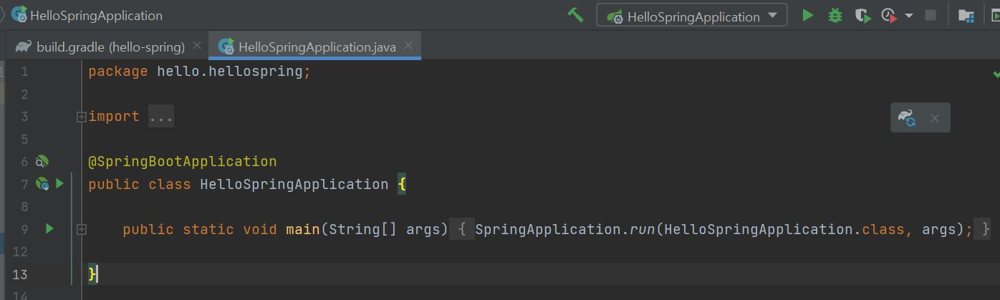

# Spring

https://www.inflearn.com/ 에서 '스프링 입문 - 코드로 배우는 스프링 부트, 웹 MVC, DB 접근 기술_김영한' 강의를 보고 정리했다.

---
---
## 섹션 0. 강의소개

---
---

### 간단한 웹 애플리케이션 개발

- 스프링 프로젝트 생성
- 스프링 부트로 웹 서버 실행
- 회원 도메인 개발
- 웹 MVC 개발
- DB 연동 - JDBC, JPA, 스프링 데이터 JPA
- 테스트 케이스 작성

---

### 프로젝트 사용기술

- Spring Boot
- Gradle
- Thymeleaf
- HIBERNATE
- JPA

---

### 강의 목표

- 스프링 학습의 제대로 된 첫 길잡이 역할
- 스프링 기술 그 자체에 매몰 X
- 어떻게 사용해야 하는지에 초점
- 오래된 스프링 기술 X
- 마이너한 스프링 기술 X

---

### 스프링 완전 정복 로드맵

- 스프링 입문
- 스프링 핵심 원리
- 스프링 웹 MVC
- 스프링 DB 데이터 접근 기술
- 실전! 스프링 부트


---
---

## 섹션 1. 프로젝트 환경설정

---
---

### 스프링 부트 스타터 사이트로 이동해서 스프링 프로젝트 생성

- 옛날에는 스프링 프로젝트를 밑바닥부터 만들었지만, 요즘은 스프링 부트를 기반으로 스프링 프로젝트를 만듦.
- https://start.spring.io
  

- Project
  - 필요한 라이브러리를 땡겨서 오고, 얘가 빌드하는 라이프사이클까지 관리해주는 툴
  - 옛날에는 Maven, 요즘은 Gradle로 넘어가는 추세
  - 

- Language
  - Java
- Spring Boot
  - 버젼을 선택을 해야함
  - SNAPSHOT
    - 만들고 있는 버전
  - M1 ...
    - 정식 배포된 버전이 아님
  - 정식 배포된 버전 중 가장 좋아보이는 2.4.2로 선택
    
- Project Metadat
  - Group
    - 보통 기업명을 적음
  - Artifact
    - 빌드되어 나올때 나오는 결과물(프로젝트 명과 비슷)
  - 그외는 그냥 유지
  
- Dependencies
  - 이게 중요함.
  - Spring boot 기반으로 프로젝트를 시작할건데 어떤 라이브러리를 땡겨서 사용할 것인가에 대한 내용
  - 여기서는 web project를 만들거니까 'spring web'과 'thymeleaf'를 추가
    <br/>
    
    - thymeleaf
      - html을 만들어주는 템플릿 엔진.


- 그 후, Generate를 누르면 다운로드를 받게 된다.<br/>
    
    - 그후 원하는 폴더로 옮긴 후 압출을 풀고 '인텔리제이'에서 열기
    - 압축 푼 경로로 가서 build.gradle을 눌러서 Open
    - 

---

### 설치 후 인텔리제이에서 구조 살펴보기

- gradle 폴더
  - gradle 관련 폴더임
- src 폴더
  - main
    - java
      - 실제 package랑 소스 파일이 있음.
    - resources
      - 실제 자바 코드 파일을 제외한 xml 이나 properties나 설정파일, html 등이 들어가있음.
  - test
    - test code들과 관련된 소스들이 들어감.
    - 요즘 개발 트랜드에서 test code는 중요함
  - build.gradle
    - 이게 중요함.
    - 나중에 깊게 공부하고 지금은 gradle이 버전 설정을 하고 라이브러리를 땡겨온다 정도만 이해.
    - 
      - sourceCompatibility = '11' 은 Java 11 버전을 의미.
    - dependencies
      - 
      - implementation
        - 아까 추가한 것들
      - testImplementation
        - 기본적으로 test 라이브러리가 자동으로 들어감.
      - 
        - 이유는 모르겠으나 testImplementation 밑에 exclude가 자동으로 안적혀있어서 그냥 내가 적음.
    - repositories
      - 위 dependencies의 라이브러리를 다운받아야하는데 mavenCentral()이라는 공개된 사이트에서 다운로드 받아라라고 설정을 함.
  - .gitignore
    - 소스코드 관리해주는 곳
    - git에는 필요한 소스코드 파일만 올라가고 build된 결과물은 올라가면 안되니까 설정하는 곳은데 start.io에서 다 설정을 해줬음
  - settings.gradle
    - 나중에 gradle 배울때 공부하기
  
---

### 한번 돌려보기

- 
  - 이 경로로 들어간 뒤
- 
  - 이러한 코드들이 나온다.
- 
- 실행 후 이러한 화면이 글들이 나온다.(중요)
  - 
    - 밑에서 두번째 줄 tomcat에서 http로 port 8080으로 뜸.
- 그 후, localhost:8080 접속하면 아래와 같이 뜸.
  - 

- 여기까지 진행했으면 프로젝트 환경 설정에 성공.
---

### 라이브러리 살펴보기

편안하게 살펴봄

- 
  - 뭔가가 굉장히 많다.
  - gradle이나 maven 같은 build 툴들은 의존관계를 다 관리를 해줌
    - ex>우리가 start.sprnig.io에서 추가한 spring-booter-starter-web을 땡기면 이것이 필요한 라이브러리인 톰캣, spring web, spring MVC 이런것들을 땡겨옴(== 의존관계를 가짐)
      - 우리는 spring-booter-starter-web만 필요하지만 이 spring-booter-starter-web이 필요한 것들에도 의존을 하고 있다.
      - 그러면 gradle은 꼬리를 물어 그 친구들을 전부 땡겨온다.

- '인텔리제이' 오른쪽에 보면 gradle이 있는데 이걸 클릭하면 아래와 같이 나온다.
  - 
  - Dependencies
    - 라이브러리들과의 의존관계
    - 
      - 나는 thymeleaf 와 web 이 2개만 땡겨왔었다.
    - 
      - 하지만 위 사진 처럼 여러개의 필요한 라이브러리를 꼬리에 꼬리를 물어 계속 땡겨옴
    - tomcat
      - web server를 띄웠던 것
      - 옛날에는 WAS(or Web Server)를 직접 서버에 설치(tomcat 같은것), 그리고 거기에 자바 코드를 집어넣는다.
        - 웹서버랑 개발 라이브러리가 분리가 되어 있었다.
        - 되게 힘든 작업이지만 요즘에는 소스 라이브러리에서 웹서버를 들고있다(==임베디드(혹은 내장하고 있다.)) → 실행만 하는데도 웹서버가 뜸.
        - 
- log 관련
  - 현업에서는 System.out.println으로 출력하면 안됨 → log라는 걸로 출력해야함.
    - 그래야 log로 남겨야 심각한 것들을 따로 보는 등 log 파일을 따로 관리해서 볼 수 있음.
  - 
    - slf4j == 인터페이스
    - 실제 log를 어떤 구현체로 출력할 것인가는 요즘 logback을 많이 선택함.
    - log 관련해서 궁금한게 있으면 위 2개를 검색해서 알아보기

- test 관련 라이브러리
  - junit
    - java에서 test할때 junit 라이브러리를 보통 사용한다.

- 결론(핵심 라이브러리 → 강의자료에 나옴)
  - 스프링 부트 라이브러리
    - spring-boot-starter-web
      - spring-boot-starter-tomcat: 톰캣 (웹서버)
      - spring-webmvc: 스프링 웹 MVC
    - spring-boot-starter-thymeleaf: 타임리프 템플릿 엔진(View)
    - spring-boot-starter(공통): 스프링 부트 + 스프링 코어 + 로깅
      - spring-boot
        - spring-core
      - spring-boot-starter-logging
        - logback, slf4j
  - 테스트 라이브러리
    - spring-boot-starter-test
        - junit: 테스트 프레임워크
        - mockito: 목 라이브러리
        - assertj: 테스트 코드를 좀 더 편하게 작성하게 도와주는 라이브러리
        - spring-test: 스프링 통합 테스트 지원
---

### View 환경설정

- Welcome Page 만들기
  - 
  - localhost:8080에 접속하면 아래와 같이 뜸.
    
  - hello 를 누르면 아무것도 없으므로 에러가 뜸.
    
- Spring 기능이 엄청 많아 spring.io 에서 필요한 걸 찾는 능력이 중요함.
  - ex> Welcome Page 관련
    - spring.io → Project → Spring Boot → LEARN → 2.4.2 옆의 Reference Document 클릭 → Spring Boot Features → ctrl+F 로 welcome page 검색
      
    - 근데 이거는 정적(static)임.
- 템플릿 엔진
  - 템플릿 엔진을 사용하면 정적이아닌 동적으로 페이지를 바꿀 수 있음.
  - 여기서는 thymeleaf 템플릿 엔진 사용.
  - thymeleaf 공식 사이트: https://www.thymeleaf.org/
  - 스프링 공식 튜토리얼: https://spring.io/guides/gs/serving-web-content/
  - 스프링부트 메뉴얼: https://docs.spring.io/spring-boot/docs/2.3.1.RELEASE/reference/html/spring-boot-features.html#boot-features-spring-mvc-template-engines


---

### Controler

- 
  - hello.hellospring 안에 'controller' 라는 Package 생성
    - 'controller' Package안에 'HelloController' 라는 Java Class 생성
- Controller Class는 @Controller를 위에 적어줘야함.(아래 사진에서 제일 위 'Controller'라고 적힌거)
  - @를 Annotatino이라고 함.
  - 

- 
  - @GetMapping(~~)
  - 웹 어플리케이션에서 /hello 라고 들어오면 아래의 method를 호출해준다.
- 아래와 같이 코드 작성
    ```java
    package hello.hellospring.controller;

    import org.springframework.stereotype.Controller;
    import org.springframework.ui.Model;
    import org.springframework.web.bind.annotation.GetMapping;

    @Controller
    public class HelloController {
        @GetMapping("hello")
        public String hello(Model model){
            model.addAttribute("data", "hello!!");
            return "hello";
        }
    }

    ```
- 그 후, src/resources/templetes/ 에 hello.html 생성
  - 
  - 강의 자료에 있는 코드 복붙
    - 
  
- 
  - xml 스키마로 템플릿 엔진이 선언이 되어있는 모습.
  - 이러면 템플릿 엔진인 thymeleaf 문법을 사용할 수 있다.
- 
  - "${data}" 는 아까 Controller에 작성한 model.addAttribute에서 key넣었던 "data"의 value는 "hello!!"이다.
    - 즉, "${data}" → "hello!!"로 치환.
  - 
- 
  - @GetMapping에서의 Get은 Get / Post 할때 그 Get임
    - http url 을 임의로 치고 엔터치면 그걸 Get 방식이라고 함.
    - 그러면 controller에 있는 해당 method가 실행이 됨.
    - Spring이 Model이라는 것을 만들어서 매개변수로 넣어줌.
    - model에다가 addAttribute해서 key는 "data", value는 "hello!"를 넣어준다.
    - 그리고 "hello"를 리턴해준다.
      - 
        - return "hello"의 의미는 resources/templetes/hello로 가서 model이라는 것을 넘겨라.
    - mapping 경로는 resources:templates/'+{ViewName}+'.html'이다.
- 참고: spring-boot-devtools 라이브러리를 추가하면, html 파일을 컴파일만 해주면 서버 재시작 없이 View 파일 변경이 가능하다.
- 인텔리J 컴파일 방법: 메뉴 build Recompile

---

### 빌드하고 실행하기

- 강의에서는 맥 터미널로 진행해서 나는 wsl2로 진행함. → windown와 wsl2에서 java 환경변수 문제로 안되어서 그냥 cmd창에서 진행함(<strong>git bash</strong>로 하는게 더 편한듯)
  - gradlew + enter → gradlew build + enter
  - 그 후 build/libs 로 들어가기
    - 
  - 그 후, java -jar hello-spring-0.0.1-SNAPSHOT.jar 을 입력하면 console에서 저 jar 파일이 실행이 됨.
- 즉, 서버를 배포할때는 저 jar 파일만 복사해서 서버에 넣고 거기에서 java -jar를 실행시키면 서버에서 spring이 동작을 함.

- ./gradlew clean build
  - build 폴더가 없어짐
- 

---
---
## 섹션 2. 스프링 웹 개발 기초
---
---

### 웹을 개발한다는 것
  1. 정적 컨텐츠
     - 서버에서 뭐 하는거 없이 그냥 파일을 그대로 웹브라우저로 내려줌  
  2. MVC와 템플릿 엔진
     - 가장 많이 하는 방식
     - jsp, php → 이것들은 템플릿 엔진
     - Model-View-Controller 패턴으로 개발함 
     - server에서 변형해서 <strong>html</strong>을 바꿔서 내려주는 방식
  3. API 방식
     - 안드로이드나 아이폰 client랑 개발하면 서버에서는 <strong>json</strong>이라는 data format으로 내려줌 
     - api로 data만 내려주면 화면은 client가 알아서 그리고 정리하는데 이때 api방식을 많이 사용
     - 서버끼리 통신할때 html을 주고받을 필요 없이 data만 주고 받기 위해 사용함

---

### 정적 컨텐츠
  - spring boot는 정적 컨텐츠 기능을 기본적으로 제공
  - resources/static/ 에서 hello-static.html 생성해서 강의자료에 있는 코드 복붙
  - 
  - 
    - 웹 브라우저에서 localhost:8080/hello-static.html 치면<br/> 
      1) 내장 톰켓 서버가 요청을 받고
      2) hello-static.html이 왔다는 것을 spring에게 넘김 
      3) spring은 controller쪽에서 hello-static이라는 것이 있는지 찾아본다(controller가 우선순위를 가진다는 뜻) 
      4) hello라는 controller는 있었지만 hello-static이라는 controller는 없음 
      5) 없으면 그 다음 resources:static/hello-static.html 이라는 것을 찾는다. 
      6) 그렇게 해서 있으면 그것을 반환해줌

---

### MVC와 템플릿 엔진

  - MVC == Model-View-Controller
  - 과거에는 controller랑 view가 따로 분리되어 있지 않고 view에서 개발을 다함
    - jsp나 asp 그렇게 많이 함
    - 이를, Model one 방식이라고 함
    - 이렇게하면 유지보수 너무 힘들다. view 파일에만 수천 줄의 코드가 된다.
  - 요즘에는 MVC 방식으로 많이 함.
    - 관심사를 분리해야하기 때문에(역할과 책임)
    - View는 화면을 그리는데에 집중
    - Model 이나 Controller는 뭔가 business logic이나 내부적인 것(백엔드)을 처리하는데 집중.
    - 그래서 백엔드에서 처리를 하여서 화면(View)에서 필요한 정보들을 model이라는 것에 담아서 넘겨주는 패턴을 많이 사용.
- 
  - 저기서 hello! empty는 템플릿 엔진으로서 동작을 하면 왼쪽의 값으로 내용이 치환, 템플릿 엔진으로서 동작을 안하면(서버없이 파일의 경로로 직접 열 경우) hello! empty 출력

- controller에다가 추가로
    ```java
    @GetMapping("hello-mvc")
        public String helloMvc(@RequestParam("name") String name, Model model){
            model.addAttribute("name",name);
            return "hello-template";
        }
    ```
    를 입력하고, localhost:8080/hello-mvc를 치면 에러가 남.
    - 에러가 나면 일단 log를 봐야함.
      - 
      - 
    - @RequestParam("name")으로 커서 이동 후 Ctrl+P 누르면 파라미터 정보를 볼 수 있음
  - localhost:8080/hello-mvc?name=spring을 입력하면 http GET 방식에서 ? ~~~ 로 parameter를 넘겨줄 수 있음.
    - 그러면 name에 spring을 넘겨주어서 다음과 같은 결과가 나온다.
    - 
  - 
    - 웹브라우저에서 localhost:8080/hello-mvc를 넘기면
      1) 내장 톰켓 서버를 거쳐서 spring한테 hello-mvc라는 것이 왔다고 던져줌
      2) spring은 helloController에 저 method가 mapping이 되어 있어서 그 method를 호출해준다
      3) return은 "hello-template" model(name:spring) 이렇게 spring한테 넘겨준다
      4) viewResolver(화면과 관련된 해결자, view를 찾아주고 템플릿 엔진과 연결 시켜줌)가 templates/hello-template.html를 찾아서 thymeleaf 템플리 엔진에 처리해달라고 넘김.
      5) 템플릿 엔진이 렌더링을 해서 변환을 한 html을 웹 브라우저에 반환을 한다.(정적일때는 이때, 변환을 하지 않고 반환)
  - 

---

## API 방식

- 일단 코딩
  - 마찬가지로 controller에 아래 코드 추가
    ```java
    @GetMapping("hello-string")
    @ResponseBody
    public String helloString(@RequestParam("name") String name){
        return "hello " + name;
    }
    ``` 
    - @ResponseBody란 http 통신 프로토콜에서 header와 body가 있는데 body에 이 data를 내가 직접 넣어주겠다라는 뜻.(html에서의 body 태그가 아님)
    - 템플릿 엔진과의 차이는 View 이런거 없이 문자가 그대로 내려감.
    - 실행하면 아래와 같이 나옴.
        
    - 코드를 보면 이렇게 나옴
        
        - 그냥 문자가 그대로 내려감.(즉, view 없이 그대로 내려줌)
        - 근데 이렇게는 거의 쓸 일 없음
- 뭔가 data를 줘야할 떄(이거 때문에 api 방식을 많이 사용)
  - 일단 코딩
    ```java
    @GetMapping("hello-api")
    @ResponseBody
    public Hello helloApi(@RequestParam("name") String name){
        Hello hello = new Hello();
        hello.setName(name);
        return hello;
    }

    static class Hello{
        private String name;

        public String getName() {
            return name;
        }

        public void setName(String name) {
            this.name = name;
        }
    }
    ``` 
    - return을 class로 넘겨준다.
    - class에는 getter와 setter가 있어야 하는데 이는 alt+insert(나같은 경우 alt+function+delete)를 눌러줘서 getter and setter 클릭
    - 참고로, 인텔리제이에서 자동완성 단축키는 ctrl+shift+enter 이다.
    - getter, setter 란 java bin 규약이라고 함
      - private String name 같은 경우 private이니까 외부에서 못 꺼내니까 외부에서 사용할려면 이러한 getter나 setter를 통해서 접근을 하게 됨.
      - property 접근 방식이라고도 함.
  - 그 후 실행하면, 아래와 같이 나옴
    - 
      - json이란 간단히 설명하면 key:value로 이루어진 구조.
  - spring 같은 경우 객체를 반환하고 @ResponseBody를 적어두면 그러면 json으로 반환하는게 default임.(xml으로도 할 수는 있음. 근데 요즘은 잘 안사용한다.)

- @ResponseBody 사용 원리
  - 
    - 웹 브라우저에서 먼저 localhost:8080/hello-api를 입력하면
      1) 톰켓 내장 서버에서 hello-api가 왔다고 spring에게 던짐.
      2) spring은 controller에 hello-api를 찾고 찾았는데 @ResponseBody라는 annotation이 붙어있으면(안 붙어 있으면(즉, 템플릿 같은경우) viewResolver에거 던져줌) 이때 반환하는 값이 객체가 오면 json 방식으로 데이터를 만들어서 http 응답에 반환하겠다(이게 기본 정책)<br/>
      return: hello(name:spring)
      3) HttpMessageConverter라는 아이가 동작을 함.
         1) 단순 문자이다 → StringConverter가 동작(실제 이름은 StringHttpMessageConverter)
         2) 객체이다 → JsonConverter가 동작(실제 이름은 MappingJackson2HttpMessageConverter)
            - 객체를 json 스타일로 바꾼다.
            - Jackson이란 객체를 json으로 바꿔주는 라이브러리
              - 객체를 json으로 바꿔주는 유명한 라이브러리는 jackson과 gson이 이렇게 있다.
      4) 바꾼 json을 요청한 서버 혹은 웹브라우저에게 준다.

- 정리
  - 정적 컨탠츠
    - 그냥 파일을 그대로 내려준다.
  - MVC 와 템플릿 엔진
    - 템플릿 엔진을 Model-View-Control 방식으로 쪼개서 이제 View를 템플릿 엔진으로 html을 랜더링해서 랜더링이 된 html을 client에게 전달해준다.
  - API
    - 객체를 반환해서 httpmessageconverter를 통해서 json 파일로 변환 후 반환을 해줌
    - view 이런거 없이 바로 http response에 다가 바로 줌.

---
---
## 섹션 3. 회원 관리 예제 - 백엔드 개발
---
---

- 비즈니스 요구사항 정리
- 회원 도메인과 리포지토리 만들기
- 회원 리포지토리 테스트 케이스 작성
- 회원 서비스 개발
- 회원 서비스 테스트 ( → junit이라는 test 프레임워크로 만들거임)

---

### 비즈니스 요구사항 정리

간단하게 하겠음.
- 데이터: 회원 ID, 이름
- 기능: 회원 등록, 조회
- 가상의 시나리오: 아직 데이터 저장소가 선정되지 않았다.
  - ex> 개발자가 개발을 해야하는데 DB가 선정이 안되었을 경우(DB를 관계형 DB를 할지, NoSQL을 할지, 성능이 중요한 DB를 할지 등)인데도 개발을 해야하는 경우

- 
  - 컨트롤러
    - 웹 MVC의 컨트롤러의 역할
  - 서비스
    - 핵심 비즈니스 로직 구현
    - EX> 회원은 중복가입이 안된다.
  - 도메인
    - 회원, 주문, 쿠폰 등등 처럼 주로 데이터베이스에 저장하고 관리되는 비즈니스 도메인 객체
  - 서비스
    - 비즈니스 도메인 객체를 가지고 핵심 비즈니스 로직이 동작하도록 구현한 계층

- 클래스 의존관계
  - 
    - 회원 비지니스 로직에는 MemberService가 있다.
    - 회원을 저장하는 MemberRepository는 interface로 설계.
      - Why? 아직 데이터 저장소가 선정되지 않아서
    - 구현체를 Memory 구현체로 만들 예정
      - 일단 개발을 해야하니까 memory 모드로 단순하게 만들고 향후 구체적인게 선정되면 바꿔 끼운다(그러므로 interface가 필요)
  - 아직 데이터 저장소가 선정되지 않아서, 우선 인터페이스로 구현 클래스를 변경할 수 있도록 설계.
  - 데이터 저장소는 RDB, NoSQL 등등 다양한 저장소를 고민중이 상황으로 가정
  - 개발을 진행하기 위해서 초기 개발 단계에서 구현체로 가벼운 메모리 기반의 데이터 저장소 사용

---

### 회원 도메인과 리포지토리 만들기

- 일단 코딩
  - domain package 만들기
    - Member라는 Class 생성
      - id와 name이 있다.
        - 각각 getter setter 생성
  - repository package 만들기
    - Member 객체를 저장하는 저장소를 만듦
    - 
    - 만들 기능들
      ```java
      public interface MemberRepository {
          Member save(Member member);
          Optional<Member> findById(Long id);
          Optional<Member> findByName(String name);
          List<Member> findAll();
      }
      ```
    - Optional
      - Java8에 들어간 기능
      - findById나 findByName으로 가져오는 없을 수 도 있다. 그러면 NULL을 반환되지만 요즘에는 NULL을 처리하는 방법에서 NULL을 그대로 반환하기보다는 Optional이라는 것으로 감싸서 반환하는 것을 선호.
    - 그런 후, 이 저장소(repository package)에서 findById나 findByName으로 찾아올 수도 있고, findAll로 지금까지 저장된 모든 회원 리스트를 반환하도록 개발할거다.
  - 구현체 만들기
    - 
    interface를 구현해야함
    ```java
    ``` 
      - save를 할때 어딘가에 저장해야함
        ```java
        private static Map<Long, Member> store = new HashMap<>();
        ``` 
        - 실무에서는 동시성 문제가 있을 수 있어서 공유되어지는 변수일때는 HashMap 대신 ConcurrentHashMap을 사용해야함.
      - 0,1,2 이렇게 key 값을 생성해주는 존재
        ```java
        private static long sequence = 0L;
        ``` 
        - 실무에서는 동시성 문제때문에 long 보다는 다른 걸 사용
      - save
        ```java()
        @Override
        public Member save(Member member) {
            member.setId(++sequence);
            store.put(member.getId(), member);
            return member;
        }
        ``` 
        - store에다가 넣기 전에 member의 id 값을 setting(이름은 save하기전에 넘어왔는 상태임)
        - 그 후 store에다가 저장(Map에 저장이 됨)
        - 저장된 결과를 반환.
      - findByID()
        - store에서 그냥 꺼내면 됨.
        - 근데 반환 값이 NULL일 경우가 있을 수도 있으면 Optional로 감싸서 반환해야함. → 그래야 client에서 뭘 할 수가 있음.
        ```java
        @Override
        public Optional<Member> findById(Long id) {
            return Optional.ofNullable(store.get(id));
        }
        ``` 
      - findByName()
        ```java
        @Override
        public Optional<Member> findByName(String name) {
            return store.values().stream()
                .filter(member -> member.getName().equals(name))
                .findAny();
        }
        ``` 
        - 위에 저거는 java8 람다 기능임.
        - Map.values().stream() 는 loop로 돌리는 거임
        - .filter(member -> member.getName().equals(name)) : parameter로 받은 "name"이 같은지 확인
        - .findAny(); : 그 중 하나라도 찾으면 그 결과가 Optional로 반환
        - 근데 끝까지 loop 돌렸는데 없으면 Optional에 NULL 포함이 되어서 반환.
      - findAll()
        ```java
        @Override
        public List<Member> findAll() {
            return new ArrayList<>(store.values());
        }
        ``` 
        - 자바 실무에서는 List를 많이 사용함.
          - loop 돌리기 편하고 해서
        - store에 있는 values는 Member들이니까 Member들이 반환이 됨.
  - 이렇게 구현한 구현체들이 잘 작동하는 검증해야함.
    - test case를 작성해서 검증하기.

---

### 회원 리포지토리와 테스트 케이스 작성

    개발한 기능을 실행해서 테스트 할 때 자바의 main 메서드롤 통해서 실행하거나, 웹 애플리케이션의 컨트롤러를 통해서 해당 기능을 실행한다. 이러한 방법은 준비하고 실행하는데 오래 걸리고, 반복 실행하기 어렵고 여러 테스트를 한번에 실행하기 어렵다는 단점이 있다. 이를 해결하고자 자바는 JUnit이라는 프레임워크로 테스트를 실행해서 이러한 문제를 해결한다.
- 아래와 같이 test할 repository에서의 test할 클래스를 만들어준다.
  - 
- @Test를 적어주면 그 아래 method를 실행할 수 있음
  ```java
  class MemoryMemberRepositoryTest {

    MemberRepository repository = new MemoryMemberRepository();

    @Test
    public void save(){
        Member member = new Member();
        member.setName("spring");

        repository.save(member);

        Member result = repository.findById(member.getId()).get();
        //System.out.println("result = " + (result == member));
        //Assertions.assertEquals(member,result); //org.junit.jupiter.api
        Assertions.assertThat(member).isEqualTo(result); //org.assertj.core.api
    }
  }
  ```
    - Optional에서 값을 꺼낼때는 .get()
    - System.out.println으로 해도 되나 글자를 계속 볼 수는 없으니까
- save() method test 실행
  - Case1) org.junit.jupiter.api
    - 우리가 기대하는 것(member)이 find에서 했을때 튀어나와야함.
    - 
    - 성공 시 초록불
      - 
    - 실패 시 빨간불
      
  - Case2) org.assertj.core.api(이걸 더 많이 사용)
    - 영어가 직관전임 → member가 result 똑같아?
    - 
      ```java
      assertThat(member).isEqualTo(result);
      ``` 
      이렇게 변경되고 다음부터는 그냥 assertThat으로 치면 됨.
    - 마찬가지로 성공시 초록불, 실패시 빨간불

Tip: Shift + F6을 누르면 그 아래에 있는 것들 Rename됨.
- findByName() method test 실행
  - 일부러 성공
    ```java
    @Test
    public void findByName(){
        Member member1 = new Member();
        member1.setName("spring1");
        repository.save(member1);

        Member member2 = new Member();
        member2.setName("spring2");
        repository.save(member2);

        Member result = repository.findByName("spring1").get();

        assertThat(result).isEqualTo(member1);
    }
    ```
    - 위 test 경우 "spring1"을 가져오면 result는 member1(setName으로 spring1 저장)이므로 성공
    
  - 일부러 실패
    ```java
    @Test
    public void findByName(){
        Member member1 = new Member();
        member1.setName("spring1");
        repository.save(member1);

        Member member2 = new Member();
        member2.setName("spring2");
        repository.save(member2);

        Member result = repository.findByName("spring2").get();

        assertThat(result).isEqualTo(member1);
    }   
    ```
    - 위 test 경우 "spring2"를 가져오면 result는 member2이다.
    - 그러므로 member1과 다르므로 실패.

- Class 안 method 전부 Test
  - 
  - class 옆 초록버튼 눌러서 run 하면 됨.
  - 
    - 둘 다 정상 작동하는 것을 확인할 수 있다.

  - findAll() method Test 실행
    - 
    ```java
    @Test
    public void findAll(){
        Member member1 = new Member();
        member1.setName("spring1");
        repository.save(member1);

        Member member2 = new Member();
        member2.setName("spring2");
        repository.save(member2);

        List<Member> result = repository.findAll();

        assertThat(result.size()).isEqualTo(2);
    }
    ```
      - 
        - 이 method를 개별적으로 test 했을때 성공한 모습
    - 하지만 class를 test할 경우 error가 난다.
      - 
        - test 순서는 보장이 안됨.
          - 모든 test는 순서랑 상관 없이 method별로 따로 동작하게 설계를 해야함.
        - 위 사진에 따르면, findAll()이 먼저 실행이 됨
          - 이때, "spring1"과 "spring2"가 저장이 되어버림.
            - 그래서 findByName()을 할때 뭔가 다른 객체(이전에 저장한 "spring1" 객체)가 나와버림.
        - 그러면 어떻게 해야하는가?(중요)
          - test가 하나 끝나면 data를 깔끔하게 clear해줘야함. 
          - MemoryMemberRepository()만 test하는 거니까 변수를 인터페이스가 아닌 MemoryMemberRepository로 바꾸기.
            - 
            ```java
            MemoryMemberRepository repository = new MemoryMemberRepository();
            ```
          - 그 후, main/repository로 가서 구현체에 다가 clear해주는 method 추가
            - 
            ```java
            public void clearStore(){
                store.clear();
            }
            ```
              - store를 비워줌
          - @AfterEach (다시 test로 넘어와서)
            - 어떠한 method가 실행이 끝날때 마다 동작을 함.(call-back method) 
            - 
            ```java
            @AfterEach
            public void afterEach(){
                repository.clearStore();
            }
            ```
              - test가 실행이 되고 끝날때마다 한번씩 저장소를 clear 해줌 == test 순서가 상관이 없어짐
              - 
                - 전부 성공한 모습
        - 요약
          - test는 서로 순서와 상관없이(서로 의존관계없이) 설계가 되어야 한다.
          - 그러기 위해서는 하나의 test가 끝날때마다 뭔가 저장소나 공용 데이터들을 지워줘야 문제가 없다.

- 이렇게 먼저 개발을 한 다음(MemoryMemberRepository)에 쭈욱 개발을 끝낸 후, Test를 작성할 수도 있고,
- 반대로, Test class를 먼저 작성을 한 뒤, 개발 할 것(MemoryMemberRepository)을 작성을 할 수 도 있다.
  - 미리 검증할 수 있는 틀을 만들고, 그 후 내가 만들고나서 이 틀에다가 잘 맞춰지는지 검사.
  - TDD(테스트 주도 개발)이라고 한다.
  - 즉, test를 만듦 → 구현 class를 만듦 → test해보기.

- 만약 test 해야할게 많다면?
  - 
  - 아니면 gradlew 띄어서 test하기.

- 이 test code가 없이 개발할때는 나혼자는 괜찮지만 여러명에서 같이 개발을 할때, 또 소스코드가 길어질수록 test code없이 개발하는건 거의 불가능.

---


내일은 회원 서비스 개발 강의부터 시작.